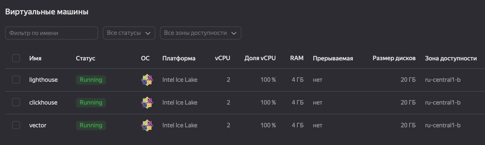
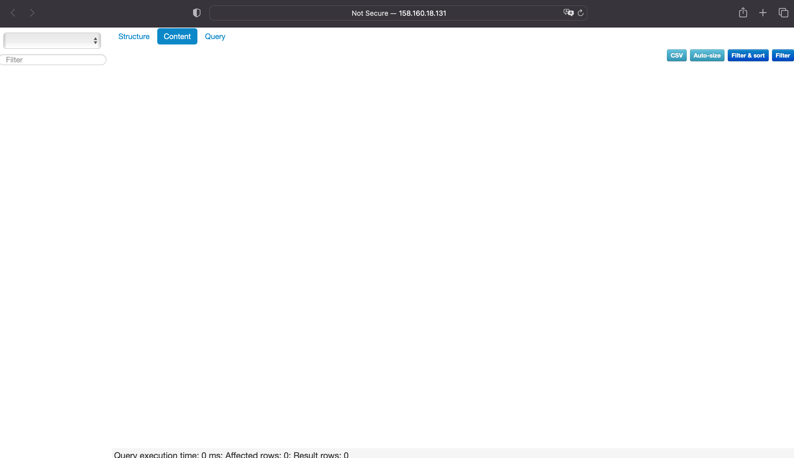

# [Домашнее задание к занятию 3 «Использование Ansible»](https://github.com/netology-code/mnt-homeworks/tree/MNT-video/08-ansible-03-yandex)

## Подготовка к выполнению

1. Подготовьте в Yandex Cloud три хоста: для `clickhouse`, для `vector` и для `lighthouse`.
<p align="left">
  
</p>
2. Репозиторий LightHouse находится [по ссылке](https://github.com/VKCOM/lighthouse).

## Основная часть

>1. Допишите playbook: нужно сделать ещё один play, который устанавливает и настраивает LightHouse.
>2. При создании tasks рекомендую использовать модули: `get_url`, `template`, `yum`, `apt`.
>3. Tasks должны: скачать статику LightHouse, установить Nginx или любой другой веб-сервер, настроить его конфиг для открытия LightHouse, запустить веб-сервер.

[`site.yml`](./site.yml)

>4. Подготовьте свой inventory-файл `prod.yml`.

[`prod.yml`](./playbook/inventory/prod.yml.example)

>5. Запустите `ansible-lint site.yml` и исправьте ошибки, если они есть.

```shell
ansible-lint site.yml 

Passed with production profile: 0 failure(s), 0 warning(s) on 1 files.
```

>6. Попробуйте запустить playbook на этом окружении с флагом `--check`.
```shell
ansible-playbook -i ./inventory/prod.yml site.yml --check

PLAY [Install Clickhouse] ********************************************************************************************************************************************************************************************************************************************************************************************************

TASK [Gathering Facts] ***********************************************************************************************************************************************************************************************************************************************************************************************************

ok: [clickhouse-01]

TASK [Get clickhouse distrib] ****************************************************************************************************************************************************************************************************************************************************************************************************
changed: [clickhouse-01] => (item=clickhouse-client)
changed: [clickhouse-01] => (item=clickhouse-server)
failed: [clickhouse-01] (item=clickhouse-common-static) => {"ansible_loop_var": "item", "changed": false, "dest": "./clickhouse-common-static-22.3.3.44.rpm", "elapsed": 0, "item": "clickhouse-common-static", "msg": "Request failed", "response": "HTTP Error 404: Not Found", "status_code": 404, "url": "https://packages.clickhouse.com/rpm/stable/clickhouse-common-static-22.3.3.44.noarch.rpm"}

TASK [Get clickhouse distrib] ****************************************************************************************************************************************************************************************************************************************************************************************************
changed: [clickhouse-01]

TASK [Install clickhouse packages] ***********************************************************************************************************************************************************************************************************************************************************************************************
fatal: [clickhouse-01]: FAILED! => {"changed": false, "msg": "No RPM file matching 'clickhouse-common-static-22.3.3.44.rpm' found on system", "rc": 127, "results": ["No RPM file matching 'clickhouse-common-static-22.3.3.44.rpm' found on system"]}

PLAY RECAP ***********************************************************************************************************************************************************************************************************************************************************************************************************************
clickhouse-01              : ok=2    changed=1    unreachable=0    failed=1    skipped=0    rescued=1    ignored=0
```

>7. Запустите playbook на `prod.yml` окружении с флагом `--diff`. Убедитесь, что изменения на системе произведены.

Запуск не первый, отлаживал ошибки.

```shell
ansible-playbook -i ./inventory/prod.yml site.yml --diff

PLAY [Install Clickhouse] ********************************************************************************************************************************************************************************************************************************************************************************************************

TASK [Gathering Facts] ***********************************************************************************************************************************************************************************************************************************************************************************************************
 
ok: [clickhouse-01]

TASK [Get clickhouse distrib] ****************************************************************************************************************************************************************************************************************************************************************************************************
ok: [clickhouse-01] => (item=clickhouse-client)
ok: [clickhouse-01] => (item=clickhouse-server)
failed: [clickhouse-01] (item=clickhouse-common-static) => {"ansible_loop_var": "item", "changed": false, "dest": "./clickhouse-common-static-22.3.3.44.rpm", "elapsed": 0, "gid": 1000, "group": "evgeniy", "item": "clickhouse-common-static", "mode": "0755", "msg": "Request failed", "owner": "evgeniy", "response": "HTTP Error 404: Not Found", "secontext": "unconfined_u:object_r:user_home_t:s0", "size": 246310036, "state": "file", "status_code": 404, "uid": 1000, "url": "https://packages.clickhouse.com/rpm/stable/clickhouse-common-static-22.3.3.44.noarch.rpm"}

TASK [Get clickhouse distrib] ****************************************************************************************************************************************************************************************************************************************************************************************************
ok: [clickhouse-01]

TASK [Install clickhouse packages] ***********************************************************************************************************************************************************************************************************************************************************************************************
ok: [clickhouse-01]

TASK [Flush handlers] ************************************************************************************************************************************************************************************************************************************************************************************************************

TASK [Create database] ***********************************************************************************************************************************************************************************************************************************************************************************************************
ok: [clickhouse-01]

PLAY [Install Vector] ************************************************************************************************************************************************************************************************************************************************************************************************************

TASK [Gathering Facts] ***********************************************************************************************************************************************************************************************************************************************************************************************************
 
ok: [vector-01]

TASK [Get vector distrib] ********************************************************************************************************************************************************************************************************************************************************************************************************
ok: [vector-01]

TASK [Install vector] ************************************************************************************************************************************************************************************************************************************************************************************************************
ok: [vector-01]

TASK [Configure vector] **********************************************************************************************************************************************************************************************************************************************************************************************************
ok: [vector-01]

PLAY [Lighthouse] ****************************************************************************************************************************************************************************************************************************************************************************************************************

TASK [Gathering Facts] ***********************************************************************************************************************************************************************************************************************************************************************************************************
 
ok: [lighthouse-01]

TASK [Install dependencies] ******************************************************************************************************************************************************************************************************************************************************************************************************
ok: [lighthouse-01]

TASK [Create nginx path] *********************************************************************************************************************************************************************************************************************************************************************************************************
ok: [lighthouse-01]

TASK [Create nginx log path] *****************************************************************************************************************************************************************************************************************************************************************************************************
ok: [lighthouse-01]

TASK [Clone lighthouse repository] ***********************************************************************************************************************************************************************************************************************************************************************************************
ok: [lighthouse-01]

TASK [Selinux add permissions] ***************************************************************************************************************************************************************************************************************************************************************************************************
ok: [lighthouse-01]

TASK [Install nginx] *************************************************************************************************************************************************************************************************************************************************************************************************************
ok: [lighthouse-01]

TASK [Nginx configure] ***********************************************************************************************************************************************************************************************************************************************************************************************************
ok: [lighthouse-01]

TASK [Nginx lighthouse configure] ************************************************************************************************************************************************************************************************************************************************************************************************
ok: [lighthouse-01]

TASK [Start nginx service] *******************************************************************************************************************************************************************************************************************************************************************************************************
ok: [lighthouse-01]

TASK [Check service] *************************************************************************************************************************************************************************************************************************************************************************************************************
ok: [lighthouse-01]

PLAY RECAP ***********************************************************************************************************************************************************************************************************************************************************************************************************************
clickhouse-01              : ok=4    changed=0    unreachable=0    failed=0    skipped=0    rescued=1    ignored=0   
lighthouse-01              : ok=11   changed=0    unreachable=0    failed=0    skipped=0    rescued=0    ignored=0   
vector-01                  : ok=4    changed=0    unreachable=0    failed=0    skipped=0    rescued=0    ignored=0
```

>8. Повторно запустите playbook с флагом `--diff` и убедитесь, что playbook идемпотентен.

playbook идемпотентен.
```shell
ansible-playbook -i ./inventory/prod.yml site.yml --diff

PLAY [Install Clickhouse] ********************************************************************************************************************************************************************************************************************************************************************************************************

TASK [Gathering Facts] ***********************************************************************************************************************************************************************************************************************************************************************************************************
 
ok: [clickhouse-01]

TASK [Get clickhouse distrib] ****************************************************************************************************************************************************************************************************************************************************************************************************
ok: [clickhouse-01] => (item=clickhouse-client)
ok: [clickhouse-01] => (item=clickhouse-server)
failed: [clickhouse-01] (item=clickhouse-common-static) => {"ansible_loop_var": "item", "changed": false, "dest": "./clickhouse-common-static-22.3.3.44.rpm", "elapsed": 0, "gid": 1000, "group": "evgeniy", "item": "clickhouse-common-static", "mode": "0755", "msg": "Request failed", "owner": "evgeniy", "response": "HTTP Error 404: Not Found", "secontext": "unconfined_u:object_r:user_home_t:s0", "size": 246310036, "state": "file", "status_code": 404, "uid": 1000, "url": "https://packages.clickhouse.com/rpm/stable/clickhouse-common-static-22.3.3.44.noarch.rpm"}

TASK [Get clickhouse distrib] ****************************************************************************************************************************************************************************************************************************************************************************************************
ok: [clickhouse-01]

TASK [Install clickhouse packages] ***********************************************************************************************************************************************************************************************************************************************************************************************
ok: [clickhouse-01]

TASK [Flush handlers] ************************************************************************************************************************************************************************************************************************************************************************************************************

TASK [Create database] ***********************************************************************************************************************************************************************************************************************************************************************************************************
ok: [clickhouse-01]

PLAY [Install Vector] ************************************************************************************************************************************************************************************************************************************************************************************************************

TASK [Gathering Facts] ***********************************************************************************************************************************************************************************************************************************************************************************************************
 
ok: [vector-01]

TASK [Get vector distrib] ********************************************************************************************************************************************************************************************************************************************************************************************************
ok: [vector-01]

TASK [Install vector] ************************************************************************************************************************************************************************************************************************************************************************************************************
ok: [vector-01]

TASK [Configure vector] **********************************************************************************************************************************************************************************************************************************************************************************************************
ok: [vector-01]

PLAY [Lighthouse] ****************************************************************************************************************************************************************************************************************************************************************************************************************

TASK [Gathering Facts] ***********************************************************************************************************************************************************************************************************************************************************************************************************
 
ok: [lighthouse-01]

TASK [Install dependencies] ******************************************************************************************************************************************************************************************************************************************************************************************************
ok: [lighthouse-01]

TASK [Create nginx path] *********************************************************************************************************************************************************************************************************************************************************************************************************
ok: [lighthouse-01]

TASK [Create nginx log path] *****************************************************************************************************************************************************************************************************************************************************************************************************
ok: [lighthouse-01]

TASK [Clone lighthouse repository] ***********************************************************************************************************************************************************************************************************************************************************************************************
ok: [lighthouse-01]

TASK [Selinux add permissions] ***************************************************************************************************************************************************************************************************************************************************************************************************
ok: [lighthouse-01]

TASK [Install nginx] *************************************************************************************************************************************************************************************************************************************************************************************************************
ok: [lighthouse-01]

TASK [Nginx configure] ***********************************************************************************************************************************************************************************************************************************************************************************************************
ok: [lighthouse-01]

TASK [Nginx lighthouse configure] ************************************************************************************************************************************************************************************************************************************************************************************************
ok: [lighthouse-01]

TASK [Start nginx service] *******************************************************************************************************************************************************************************************************************************************************************************************************
ok: [lighthouse-01]

TASK [Check service] *************************************************************************************************************************************************************************************************************************************************************************************************************
ok: [lighthouse-01]

PLAY RECAP ***********************************************************************************************************************************************************************************************************************************************************************************************************************
clickhouse-01              : ok=4    changed=0    unreachable=0    failed=0    skipped=0    rescued=1    ignored=0   
lighthouse-01              : ok=11   changed=0    unreachable=0    failed=0    skipped=0    rescued=0    ignored=0   
vector-01                  : ok=4    changed=0    unreachable=0    failed=0    skipped=0    rescued=0    ignored=0
```

<p align="left">
  
</p>


>9. Подготовьте README.md-файл по своему playbook. В нём должно быть описано: что делает playbook, какие у него есть параметры и теги.

[Readme.md](./playbook/README.md)

10. Готовый playbook выложите в свой репозиторий, поставьте тег `08-ansible-03-yandex` на фиксирующий коммит, в ответ предоставьте ссылку на него.

---
