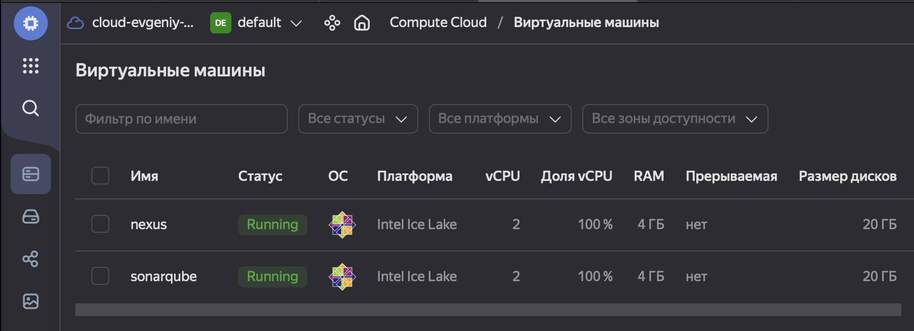
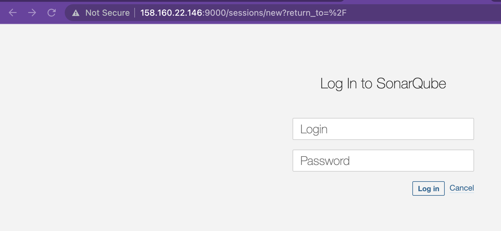
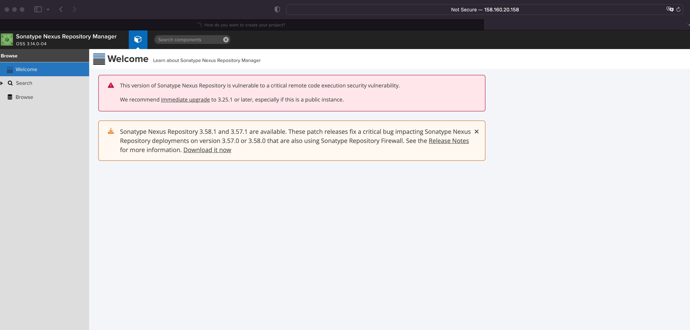
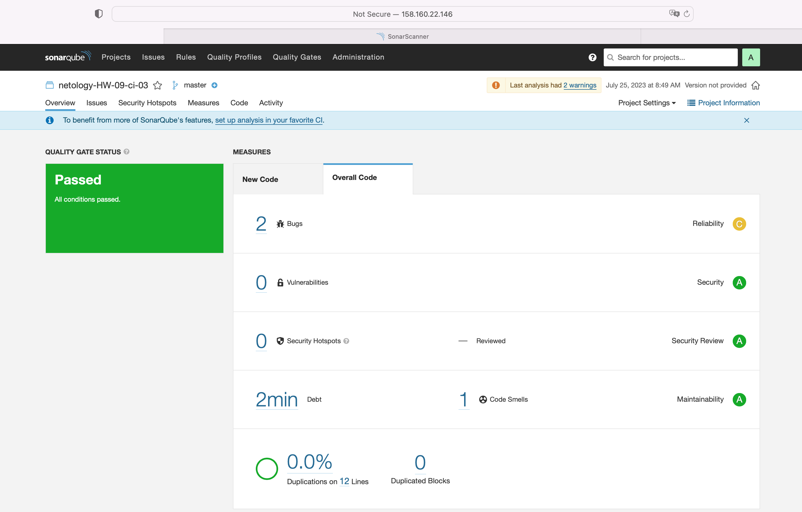
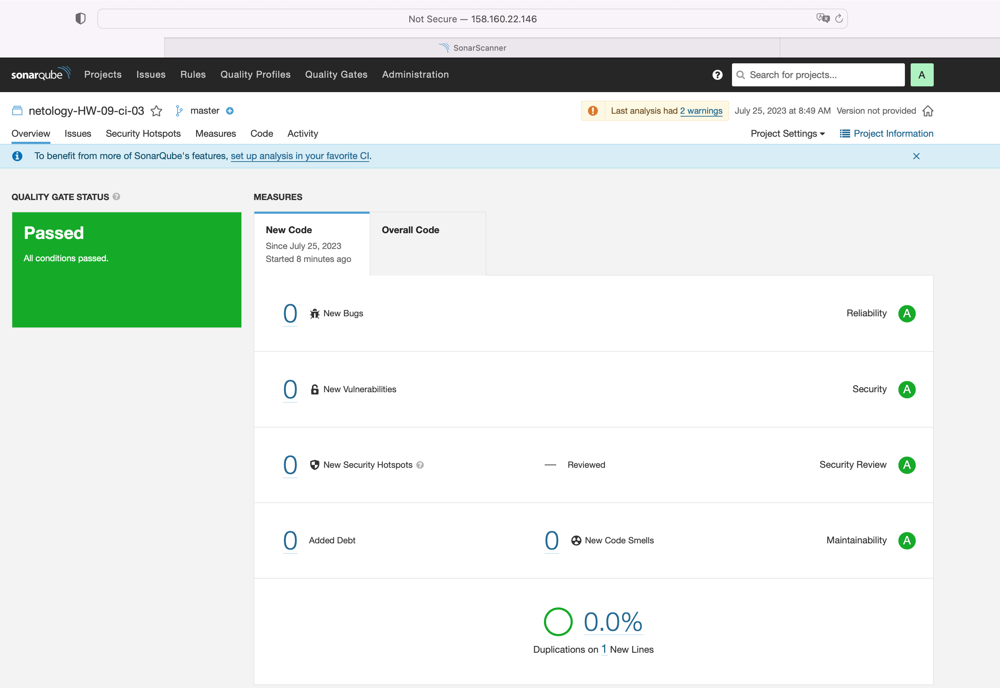
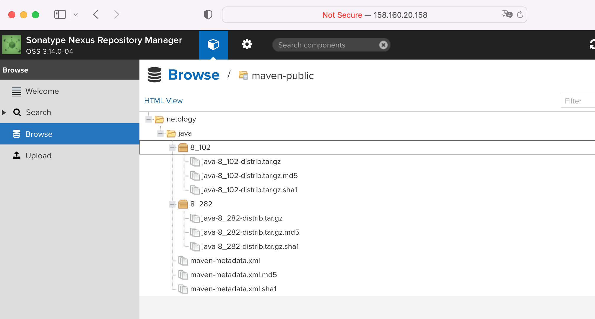

# [Домашнее задание к занятию 9 «Процессы CI/CD»](https://github.com/netology-code/mnt-homeworks/blob/MNT-video/09-ci-03-cicd/README.md)

## Подготовка к выполнению

> 1. Создайте два VM в Yandex Cloud с параметрами: 2CPU 4RAM Centos7 (остальное по минимальным требованиям).

Создал.


> 2. Пропишите в [inventory](./infrastructure/inventory/cicd/hosts.yml) [playbook](./infrastructure/site.yml) созданные хосты.

Прописал.

> 3. Добавьте в [files](./infrastructure/files/) файл со своим публичным ключом (id_rsa.pub). Если ключ называется иначе — найдите таску в плейбуке, которая использует id_rsa.pub имя, и исправьте на своё.


Добавил `id_rsa.pub`

4. Запустите playbook, ожидайте успешного завершения.

Запускаю
```shell
Evgeniy@192 infrastructure % ansible-playbook -i ./inventory/cicd/hosts.yml site.yml

PLAY [Get OpenJDK installed] ********************************************************************************************************************************************************************************************************************************************************************

TASK [Gathering Facts] **************************************************************************************************************************************************************************************************************************************************************************
Enter passphrase for key '/Users/Evgeniy/.ssh/id_rsa': 
ok: [sonar-01]

TASK [install unzip] ****************************************************************************************************************************************************************************************************************************************************************************
ok: [sonar-01]

TASK [Upload .tar.gz file conaining binaries from remote storage] *******************************************************************************************************************************************************************************************************************************
ok: [sonar-01]

TASK [Ensure installation dir exists] ***********************************************************************************************************************************************************************************************************************************************************
ok: [sonar-01]

TASK [Extract java in the installation directory] ***********************************************************************************************************************************************************************************************************************************************
skipping: [sonar-01]

TASK [Export environment variables] *************************************************************************************************************************************************************************************************************************************************************
ok: [sonar-01]

PLAY [Get PostgreSQL installed] *****************************************************************************************************************************************************************************************************************************************************************

TASK [Gathering Facts] **************************************************************************************************************************************************************************************************************************************************************************
ok: [sonar-01]

TASK [Change repo file] *************************************************************************************************************************************************************************************************************************************************************************
ok: [sonar-01]

TASK [Install PostgreSQL repos] *****************************************************************************************************************************************************************************************************************************************************************
ok: [sonar-01]

TASK [Install PostgreSQL] ***********************************************************************************************************************************************************************************************************************************************************************
ok: [sonar-01]

TASK [Init template1 DB] ************************************************************************************************************************************************************************************************************************************************************************
changed: [sonar-01]

TASK [Start pgsql service] **********************************************************************************************************************************************************************************************************************************************************************
ok: [sonar-01]

TASK [Create user in system] ********************************************************************************************************************************************************************************************************************************************************************
ok: [sonar-01]

TASK [Create user for Sonar in PostgreSQL] ******************************************************************************************************************************************************************************************************************************************************
changed: [sonar-01]

TASK [Change password for Sonar user in PostgreSQL] *********************************************************************************************************************************************************************************************************************************************
changed: [sonar-01]

TASK [Create Sonar DB] **************************************************************************************************************************************************************************************************************************************************************************
changed: [sonar-01]

TASK [Copy pg_hba.conf] *************************************************************************************************************************************************************************************************************************************************************************
ok: [sonar-01]

PLAY [Prepare Sonar host] ***********************************************************************************************************************************************************************************************************************************************************************

TASK [Gathering Facts] **************************************************************************************************************************************************************************************************************************************************************************
ok: [sonar-01]

TASK [Create group in system] *******************************************************************************************************************************************************************************************************************************************************************
ok: [sonar-01]

TASK [Create user in system] ********************************************************************************************************************************************************************************************************************************************************************
ok: [sonar-01]

TASK [Set up ssh key to access for managed node] ************************************************************************************************************************************************************************************************************************************************
ok: [sonar-01]

TASK [Allow group to have passwordless sudo] ****************************************************************************************************************************************************************************************************************************************************
ok: [sonar-01]

TASK [Increase Virtual Memory] ******************************************************************************************************************************************************************************************************************************************************************
ok: [sonar-01]

TASK [Reboot VM] ********************************************************************************************************************************************************************************************************************************************************************************
Enter passphrase for key '/Users/Evgeniy/.ssh/id_rsa': 
changed: [sonar-01]

PLAY [Get Sonarqube installed] ******************************************************************************************************************************************************************************************************************************************************************

TASK [Gathering Facts] **************************************************************************************************************************************************************************************************************************************************************************
Enter passphrase for key '/Users/Evgeniy/.ssh/id_rsa': 
ok: [sonar-01]

TASK [Get distrib ZIP] **************************************************************************************************************************************************************************************************************************************************************************
ok: [sonar-01]

TASK [Unzip Sonar] ******************************************************************************************************************************************************************************************************************************************************************************
skipping: [sonar-01]

TASK [Move Sonar into place.] *******************************************************************************************************************************************************************************************************************************************************************
changed: [sonar-01]

TASK [Configure SonarQube JDBC settings for PostgreSQL.] ****************************************************************************************************************************************************************************************************************************************
changed: [sonar-01] => (item={'regexp': '^sonar.jdbc.username', 'line': 'sonar.jdbc.username=sonar'})
changed: [sonar-01] => (item={'regexp': '^sonar.jdbc.password', 'line': 'sonar.jdbc.password=sonar'})
changed: [sonar-01] => (item={'regexp': '^sonar.jdbc.url', 'line': 'sonar.jdbc.url=jdbc:postgresql://localhost:5432/sonar?useUnicode=true&characterEncoding=utf8&rewriteBatchedStatements=true&useConfigs=maxPerformance'})
changed: [sonar-01] => (item={'regexp': '^sonar.web.context', 'line': 'sonar.web.context='})

TASK [Generate wrapper.conf] ********************************************************************************************************************************************************************************************************************************************************************
changed: [sonar-01]

TASK [Symlink sonar bin.] ***********************************************************************************************************************************************************************************************************************************************************************
ok: [sonar-01]

TASK [Copy SonarQube systemd unit file into place (for systemd systems).] ***********************************************************************************************************************************************************************************************************************
ok: [sonar-01]

TASK [Ensure Sonar is running and set to start on boot.] ****************************************************************************************************************************************************************************************************************************************
changed: [sonar-01]

TASK [Allow Sonar time to build on first start.] ************************************************************************************************************************************************************************************************************************************************
skipping: [sonar-01]

TASK [Make sure Sonar is responding on the configured port.] ************************************************************************************************************************************************************************************************************************************
ok: [sonar-01]

PLAY [Get Nexus installed] **********************************************************************************************************************************************************************************************************************************************************************

TASK [Gathering Facts] **************************************************************************************************************************************************************************************************************************************************************************
ok: [nexus-01]

TASK [Create Nexus group] ***********************************************************************************************************************************************************************************************************************************************************************
changed: [nexus-01]

TASK [Create Nexus user] ************************************************************************************************************************************************************************************************************************************************************************
changed: [nexus-01]

TASK [Install JDK] ******************************************************************************************************************************************************************************************************************************************************************************
changed: [nexus-01]

TASK [Create Nexus directories] *****************************************************************************************************************************************************************************************************************************************************************
changed: [nexus-01] => (item=/home/nexus/log)
changed: [nexus-01] => (item=/home/nexus/sonatype-work/nexus3)
changed: [nexus-01] => (item=/home/nexus/sonatype-work/nexus3/etc)
changed: [nexus-01] => (item=/home/nexus/pkg)
changed: [nexus-01] => (item=/home/nexus/tmp)

TASK [Download Nexus] ***************************************************************************************************************************************************************************************************************************************************************************
[WARNING]: Module remote_tmp /home/nexus/.ansible/tmp did not exist and was created with a mode of 0700, this may cause issues when running as another user. To avoid this, create the remote_tmp dir with the correct permissions manually
changed: [nexus-01]

TASK [Unpack Nexus] *****************************************************************************************************************************************************************************************************************************************************************************
changed: [nexus-01]

TASK [Link to Nexus Directory] ******************************************************************************************************************************************************************************************************************************************************************
changed: [nexus-01]

TASK [Add NEXUS_HOME for Nexus user] ************************************************************************************************************************************************************************************************************************************************************
changed: [nexus-01]

TASK [Add run_as_user to Nexus.rc] **************************************************************************************************************************************************************************************************************************************************************
changed: [nexus-01]

TASK [Raise nofile limit for Nexus user] ********************************************************************************************************************************************************************************************************************************************************
changed: [nexus-01]

TASK [Create Nexus service for SystemD] *********************************************************************************************************************************************************************************************************************************************************
changed: [nexus-01]

TASK [Ensure Nexus service is enabled for SystemD] **********************************************************************************************************************************************************************************************************************************************
changed: [nexus-01]

TASK [Create Nexus vmoptions] *******************************************************************************************************************************************************************************************************************************************************************
changed: [nexus-01]

TASK [Create Nexus properties] ******************************************************************************************************************************************************************************************************************************************************************
changed: [nexus-01]

TASK [Lower Nexus disk space threshold] *********************************************************************************************************************************************************************************************************************************************************
skipping: [nexus-01]

TASK [Start Nexus service if enabled] ***********************************************************************************************************************************************************************************************************************************************************
changed: [nexus-01]

TASK [Ensure Nexus service is restarted] ********************************************************************************************************************************************************************************************************************************************************
skipping: [nexus-01]

TASK [Wait for Nexus port if started] ***********************************************************************************************************************************************************************************************************************************************************
ok: [nexus-01]

PLAY RECAP **************************************************************************************************************************************************************************************************************************************************************************************
nexus-01                   : ok=17   changed=15   unreachable=0    failed=0    skipped=2    rescued=0    ignored=0   
sonar-01                   : ok=32   changed=9    unreachable=0    failed=0    skipped=3    rescued=0    ignored=0
```

5. >Проверьте готовность SonarQube через [браузер](http://localhost:9000).

Проверяю [SonarQube](http://158.160.22.146:9000) - к моменту сдачи ДЗ ВМ уже будут удалены, так что не критично что тут указан адрес.

    
6. >Зайдите под admin\admin, поменяйте пароль на свой.

Сменил пароль.

7.  >Проверьте готовность Nexus через [бразуер](http://localhost:8081).

Проверяю [nexus](http://158.160.20.158:8081) - к моменту сдачи ДЗ ВМ уже будут удалены, так что не критично что тут указан адрес.


8. >Подключитесь под admin\admin123, поменяйте пароль, сохраните анонимный доступ.

Сменил пароль.

## Знакомоство с SonarQube

### Основная часть

1. >Создайте новый проект, название произвольное.

Создал.

К моменту сдачи дз VM будут удалены
- user `netolgy` 
- token `f19608755bfe4bd78533fc5aba88d3b857caf30d`

2. >Скачайте пакет sonar-scanner, который вам предлагает скачать SonarQube.

Скачал [SonarScanner](./sonar-scanner-4.8.0.2856-macosx/)

3. >Сделайте так, чтобы binary был доступен через вызов в shell (или поменяйте переменную PATH, или любой другой, удобный вам способ).

```shell
Evgeniy@192 bin % export PATH=$(pwd):$PATH
```

4. >Проверьте `sonar-scanner --version`.

```shell
Evgeniy@192 09-ci-03-cicd % sonar-scanner --version
INFO: Scanner configuration file: /Users/Evgeniy/Projects/netology/devops-netology/homeWorks/09-ci-03-cicd/sonar-scanner-4.8.0.2856-macosx/conf/sonar-scanner.properties
INFO: Project root configuration file: NONE
INFO: SonarScanner 4.8.0.2856
INFO: Java 11.0.17 Eclipse Adoptium (64-bit)
INFO: Mac OS X 13.1 x86_64
```

5. >Запустите анализатор против кода из директории [example](./example) с дополнительным ключом `-Dsonar.coverage.exclusions=fail.py`.

```shell
Evgeniy@192 example % sonar-scanner \
  -Dsonar.projectKey=netology-HW-09-ci-03 \
  -Dsonar.sources=. \
  -Dsonar.host.url=http://158.160.22.146:9000 \
  -Dsonar.login=f19608755bfe4bd78533fc5aba88d3b857caf30d \
> -Dsonar.coverage.exclusions=fail.py
INFO: Scanner configuration file: /Users/Evgeniy/Projects/netology/devops-netology/homeWorks/09-ci-03-cicd/sonar-scanner-4.8.0.2856-macosx/conf/sonar-scanner.properties
INFO: Project root configuration file: NONE
INFO: SonarScanner 4.8.0.2856
INFO: Java 11.0.17 Eclipse Adoptium (64-bit)
INFO: Mac OS X 13.1 x86_64
INFO: User cache: /Users/Evgeniy/.sonar/cache
INFO: Analyzing on SonarQube server 9.1.0
INFO: Default locale: "en_RU", source code encoding: "UTF-8" (analysis is platform dependent)
INFO: Load global settings
INFO: Load global settings (done) | time=302ms
INFO: Server id: 9CFC3560-AYmI8MHK5yXsuMwFvozx
INFO: User cache: /Users/Evgeniy/.sonar/cache
INFO: Load/download plugins
INFO: Load plugins index
INFO: Load plugins index (done) | time=130ms
INFO: Load/download plugins (done) | time=61223ms
INFO: Process project properties
INFO: Process project properties (done) | time=16ms
INFO: Execute project builders
INFO: Execute project builders (done) | time=3ms
INFO: Project key: netology-HW-09-ci-03
INFO: Base dir: /Users/Evgeniy/Projects/netology/devops-netology/homeWorks/09-ci-03-cicd/example
INFO: Working dir: /Users/Evgeniy/Projects/netology/devops-netology/homeWorks/09-ci-03-cicd/example/.scannerwork
INFO: Load project settings for component key: 'netology-HW-09-ci-03'
INFO: Load project settings for component key: 'netology-HW-09-ci-03' (done) | time=114ms
INFO: Load quality profiles
INFO: Load quality profiles (done) | time=130ms
INFO: Load active rules
INFO: Load active rules (done) | time=4354ms
INFO: Indexing files...
INFO: Project configuration:
INFO:   Excluded sources for coverage: fail.py
INFO: 1 file indexed
INFO: 0 files ignored because of scm ignore settings
INFO: Quality profile for py: Sonar way
INFO: ------------- Run sensors on module netology-HW-09-ci-03
INFO: Load metrics repository
INFO: Load metrics repository (done) | time=144ms
INFO: Sensor Python Sensor [python]
WARN: Your code is analyzed as compatible with python 2 and 3 by default. This will prevent the detection of issues specific to python 2 or python 3. You can get a more precise analysis by setting a python version in your configuration via the parameter "sonar.python.version"
INFO: Starting global symbols computation
INFO: 1 source file to be analyzed
INFO: Load project repositories
INFO: Load project repositories (done) | time=127ms
INFO: 1/1 source file has been analyzed
INFO: Starting rules execution
INFO: 1 source file to be analyzed
INFO: 1/1 source file has been analyzed
INFO: Sensor Python Sensor [python] (done) | time=857ms
INFO: Sensor Cobertura Sensor for Python coverage [python]
INFO: Sensor Cobertura Sensor for Python coverage [python] (done) | time=13ms
INFO: Sensor PythonXUnitSensor [python]
INFO: Sensor PythonXUnitSensor [python] (done) | time=1ms
INFO: Sensor CSS Rules [cssfamily]
INFO: No CSS, PHP, HTML or VueJS files are found in the project. CSS analysis is skipped.
INFO: Sensor CSS Rules [cssfamily] (done) | time=2ms
INFO: Sensor JaCoCo XML Report Importer [jacoco]
INFO: 'sonar.coverage.jacoco.xmlReportPaths' is not defined. Using default locations: target/site/jacoco/jacoco.xml,target/site/jacoco-it/jacoco.xml,build/reports/jacoco/test/jacocoTestReport.xml
INFO: No report imported, no coverage information will be imported by JaCoCo XML Report Importer
INFO: Sensor JaCoCo XML Report Importer [jacoco] (done) | time=6ms
INFO: Sensor C# Project Type Information [csharp]
INFO: Sensor C# Project Type Information [csharp] (done) | time=1ms
INFO: Sensor C# Analysis Log [csharp]
INFO: Sensor C# Analysis Log [csharp] (done) | time=12ms
INFO: Sensor C# Properties [csharp]
INFO: Sensor C# Properties [csharp] (done) | time=0ms
INFO: Sensor JavaXmlSensor [java]
INFO: Sensor JavaXmlSensor [java] (done) | time=2ms
INFO: Sensor HTML [web]
INFO: Sensor HTML [web] (done) | time=3ms
INFO: Sensor VB.NET Project Type Information [vbnet]
INFO: Sensor VB.NET Project Type Information [vbnet] (done) | time=1ms
INFO: Sensor VB.NET Analysis Log [vbnet]
INFO: Sensor VB.NET Analysis Log [vbnet] (done) | time=9ms
INFO: Sensor VB.NET Properties [vbnet]
INFO: Sensor VB.NET Properties [vbnet] (done) | time=0ms
INFO: ------------- Run sensors on project
INFO: Sensor Zero Coverage Sensor
INFO: Sensor Zero Coverage Sensor (done) | time=1ms
INFO: SCM Publisher SCM provider for this project is: git
INFO: SCM Publisher 1 source file to be analyzed
INFO: SCM Publisher 0/1 source files have been analyzed (done) | time=142ms
WARN: Missing blame information for the following files:
WARN:   * fail.py
WARN: This may lead to missing/broken features in SonarQube
INFO: CPD Executor Calculating CPD for 1 file
INFO: CPD Executor CPD calculation finished (done) | time=16ms
INFO: Analysis report generated in 103ms, dir size=103.3 kB
INFO: Analysis report compressed in 19ms, zip size=14.4 kB
INFO: Analysis report uploaded in 192ms
INFO: ANALYSIS SUCCESSFUL, you can browse http://158.160.22.146:9000/dashboard?id=netology-HW-09-ci-03
INFO: Note that you will be able to access the updated dashboard once the server has processed the submitted analysis report
INFO: More about the report processing at http://158.160.22.146:9000/api/ce/task?id=AYmKvE88T5L0JsV7TvRy
INFO: Analysis total time: 9.247 s
INFO: ------------------------------------------------------------------------
INFO: EXECUTION SUCCESS
INFO: ------------------------------------------------------------------------
INFO: Total time: 1:20.750s
INFO: Final Memory: 8M/37M
INFO: ------------------------------------------------------------------------
```

6. >Посмотрите результат в интерфейсе.



7. >Исправьте ошибки, которые он выявил, включая warnings.

Внёс правки - [fail.py](./example/fail.py)

8. >Запустите анализатор повторно — проверьте, что QG пройдены успешно.

Повторно запускаю `sonar scaner`
```shell
Evgeniy@192 example % sonar-scanner \
  -Dsonar.projectKey=netology-HW-09-ci-03 \
  -Dsonar.sources=. \
  -Dsonar.host.url=http://158.160.22.146:9000 \
  -Dsonar.login=f19608755bfe4bd78533fc5aba88d3b857caf30d \
-Dsonar.coverage.exclusions=fail.py
INFO: Scanner configuration file: /Users/Evgeniy/Projects/netology/devops-netology/homeWorks/09-ci-03-cicd/sonar-scanner-4.8.0.2856-macosx/conf/sonar-scanner.properties
INFO: Project root configuration file: NONE
INFO: SonarScanner 4.8.0.2856
INFO: Java 11.0.17 Eclipse Adoptium (64-bit)
INFO: Mac OS X 13.1 x86_64
INFO: User cache: /Users/Evgeniy/.sonar/cache
INFO: Analyzing on SonarQube server 9.1.0
INFO: Default locale: "en_RU", source code encoding: "UTF-8" (analysis is platform dependent)
INFO: Load global settings
INFO: Load global settings (done) | time=247ms
INFO: Server id: 9CFC3560-AYmI8MHK5yXsuMwFvozx
INFO: User cache: /Users/Evgeniy/.sonar/cache
INFO: Load/download plugins
INFO: Load plugins index
INFO: Load plugins index (done) | time=128ms
INFO: Load/download plugins (done) | time=231ms
INFO: Process project properties
INFO: Process project properties (done) | time=16ms
INFO: Execute project builders
INFO: Execute project builders (done) | time=2ms
INFO: Project key: netology-HW-09-ci-03
INFO: Base dir: /Users/Evgeniy/Projects/netology/devops-netology/homeWorks/09-ci-03-cicd/example
INFO: Working dir: /Users/Evgeniy/Projects/netology/devops-netology/homeWorks/09-ci-03-cicd/example/.scannerwork
INFO: Load project settings for component key: 'netology-HW-09-ci-03'
INFO: Load project settings for component key: 'netology-HW-09-ci-03' (done) | time=93ms
INFO: Load quality profiles
INFO: Load quality profiles (done) | time=132ms
INFO: Load active rules
INFO: Load active rules (done) | time=2982ms
INFO: Indexing files...
INFO: Project configuration:
INFO:   Excluded sources for coverage: fail.py
INFO: 1 file indexed
INFO: 0 files ignored because of scm ignore settings
INFO: Quality profile for py: Sonar way
INFO: ------------- Run sensors on module netology-HW-09-ci-03
INFO: Load metrics repository
INFO: Load metrics repository (done) | time=145ms
INFO: Sensor Python Sensor [python]
WARN: Your code is analyzed as compatible with python 2 and 3 by default. This will prevent the detection of issues specific to python 2 or python 3. You can get a more precise analysis by setting a python version in your configuration via the parameter "sonar.python.version"
INFO: Starting global symbols computation
INFO: 1 source file to be analyzed
INFO: Load project repositories
INFO: Load project repositories (done) | time=86ms
INFO: 1/1 source file has been analyzed
INFO: Starting rules execution
INFO: 1 source file to be analyzed
INFO: 1/1 source file has been analyzed
INFO: Sensor Python Sensor [python] (done) | time=631ms
INFO: Sensor Cobertura Sensor for Python coverage [python]
INFO: Sensor Cobertura Sensor for Python coverage [python] (done) | time=8ms
INFO: Sensor PythonXUnitSensor [python]
INFO: Sensor PythonXUnitSensor [python] (done) | time=2ms
INFO: Sensor CSS Rules [cssfamily]
INFO: No CSS, PHP, HTML or VueJS files are found in the project. CSS analysis is skipped.
INFO: Sensor CSS Rules [cssfamily] (done) | time=0ms
INFO: Sensor JaCoCo XML Report Importer [jacoco]
INFO: 'sonar.coverage.jacoco.xmlReportPaths' is not defined. Using default locations: target/site/jacoco/jacoco.xml,target/site/jacoco-it/jacoco.xml,build/reports/jacoco/test/jacocoTestReport.xml
INFO: No report imported, no coverage information will be imported by JaCoCo XML Report Importer
INFO: Sensor JaCoCo XML Report Importer [jacoco] (done) | time=3ms
INFO: Sensor C# Project Type Information [csharp]
INFO: Sensor C# Project Type Information [csharp] (done) | time=1ms
INFO: Sensor C# Analysis Log [csharp]
INFO: Sensor C# Analysis Log [csharp] (done) | time=12ms
INFO: Sensor C# Properties [csharp]
INFO: Sensor C# Properties [csharp] (done) | time=0ms
INFO: Sensor JavaXmlSensor [java]
INFO: Sensor JavaXmlSensor [java] (done) | time=2ms
INFO: Sensor HTML [web]
INFO: Sensor HTML [web] (done) | time=4ms
INFO: Sensor VB.NET Project Type Information [vbnet]
INFO: Sensor VB.NET Project Type Information [vbnet] (done) | time=0ms
INFO: Sensor VB.NET Analysis Log [vbnet]
INFO: Sensor VB.NET Analysis Log [vbnet] (done) | time=9ms
INFO: Sensor VB.NET Properties [vbnet]
INFO: Sensor VB.NET Properties [vbnet] (done) | time=0ms
INFO: ------------- Run sensors on project
INFO: Sensor Zero Coverage Sensor
INFO: Sensor Zero Coverage Sensor (done) | time=1ms
INFO: SCM Publisher SCM provider for this project is: git
INFO: SCM Publisher 1 source file to be analyzed
INFO: SCM Publisher 0/1 source files have been analyzed (done) | time=85ms
WARN: Missing blame information for the following files:
WARN:   * fail.py
WARN: This may lead to missing/broken features in SonarQube
INFO: CPD Executor Calculating CPD for 1 file
INFO: CPD Executor CPD calculation finished (done) | time=13ms
INFO: Analysis report generated in 101ms, dir size=103.1 kB
INFO: Analysis report compressed in 21ms, zip size=14.1 kB
INFO: Analysis report uploaded in 144ms
INFO: ANALYSIS SUCCESSFUL, you can browse http://158.160.22.146:9000/dashboard?id=netology-HW-09-ci-03
INFO: Note that you will be able to access the updated dashboard once the server has processed the submitted analysis report
INFO: More about the report processing at http://158.160.22.146:9000/api/ce/task?id=AYmKwOvjT5L0JsV7TvRz
INFO: Analysis total time: 6.762 s
INFO: ------------------------------------------------------------------------
INFO: EXECUTION SUCCESS
INFO: ------------------------------------------------------------------------
INFO: Total time: 8.629s
INFO: Final Memory: 8M/37M
INFO: ------------------------------------------------------------------------
```

9. >Сделайте скриншот успешного прохождения анализа, приложите к решению ДЗ.



## Знакомство с Nexus

### Основная часть

1. >В репозиторий `maven-public` загрузите артефакт с GAV-параметрами:

 >*    groupId: netology;
 >*    artifactId: java;
 >*    version: 8_282;
 >*    classifier: distrib;
 >*    type: tar.gz.

 Загрузил.

2. >В него же загрузите такой же артефакт, но с version: 8_102.

Загрузил.

3. >Проверьте, что все файлы загрузились успешно.



4. >В ответе пришлите файл `maven-metadata.xml` для этого артефекта.

```xml
<metadata modelVersion="1.1.0">
<groupId>netology</groupId>
<artifactId>java</artifactId>
<versioning>
<latest>8_282</latest>
<release>8_282</release>
<versions>
<version>8_102</version>
<version>8_282</version>
</versions>
<lastUpdated>20230725021511</lastUpdated>
</versioning>
</metadata>
```
### Знакомство с Maven

### Подготовка к выполнению

1. >Скачайте дистрибутив с [maven](https://maven.apache.org/download.cgi).

- Скачал архив [apache-maven-3.9.3-bin.tar](https://dlcdn.apache.org/maven/maven-3/3.9.3/binaries/apache-maven-3.9.3-bin.tar.gz)

2. >Разархивируйте, сделайте так, чтобы binary был доступен через вызов в shell (или поменяйте переменную PATH, или любой другой, удобный вам способ).

- Распаковал в [apache-maven-3.9.3](./apache-maven-3.9.3/):

```shell
Evgeniy@192 09-ci-03-cicd % tar xzvf apache-maven-3.9.3-bin.tar
x apache-maven-3.9.3/README.txt
x apache-maven-3.9.3/LICENSE
x apache-maven-3.9.3/NOTICE
...
```

3. >Удалите из `apache-maven-<version>/conf/settings.xml` упоминание о правиле, отвергающем HTTP- соединение — раздел mirrors —> id: my-repository-http-unblocker.

- Закомментировал. 
```shell
<!-- Закоментеровал в рамках HW
    <mirror>
      <id>maven-default-http-blocker</id>
      <mirrorOf>external:http:*</mirrorOf>
      <name>Pseudo repository to mirror external repositories initially using HTTP.</name>
      <url>http://0.0.0.0/</url>
      <blocked>true</blocked>
    </mirror>
-->
``` 


4. >Проверьте `mvn --version`.
- Проверяю
```shell
./apache-maven-3.9.3/bin/mvn --version
The operation couldn’t be completed. Unable to locate a Java Runtime.
Please visit http://www.java.com for information on installing Java.
```
- Нужно установить [java](https://www.java.com/en/download/), качаю [dmg](https://javadl.oracle.com/webapps/download/AutoDL?BundleId=248764_8c876547113c4e4aab3c868e9e0ec572)
- Устанавливаю, проверяю установку.
```shell
Evgeniy@192 09-ci-03-cicd % /usr/libexec/java_home -V | grep jdk

Matching Java Virtual Machines (1):
    1.8.381.09 (arm64) "Oracle Corporation" - "Java" /Library/Internet Plug-Ins/JavaAppletPlugin.plugin/Contents/Home
```
- Повторно проверяю `mvn --version`
```shell
Evgeniy@192 09-ci-03-cicd % ./apache-maven-3.9.3/bin/mvn --version
Apache Maven 3.9.3 (21122926829f1ead511c958d89bd2f672198ae9f)
Maven home: /Users/Evgeniy/Projects/netology/devops-netology/homeWorks/09-ci-03-cicd/apache-maven-3.9.3
Java version: 1.8.0_381, vendor: Oracle Corporation, runtime: /Library/Internet Plug-Ins/JavaAppletPlugin.plugin/Contents/Home
Default locale: en_RU, platform encoding: UTF-8
OS name: "mac os x", version: "13.1", arch: "aarch64", family: "mac"
```


5. >Заберите директорию [mvn](./mvn) с pom.
- Скачал [mvn](./mvn/) 


### Основная часть

1. >Поменяйте в `pom.xml` блок с зависимостями под ваш артефакт из первого пункта задания для Nexus (java с версией 8_282).

Поправил [pox.xml](./mvn/pom.xml)

2. >Запустите команду `mvn package` в директории с `pom.xml`, ожидайте успешного окончания.

```shell
Evgeniy@192 mvn % ./../apache-maven-3.9.3/bin/mvn package 
[INFO] Scanning for projects...
[INFO] 
[INFO] --------------------< com.netology.app:simple-app >---------------------
[INFO] Building simple-app 1.0-SNAPSHOT
[INFO]   from pom.xml
[INFO] --------------------------------[ jar ]---------------------------------
Downloading from central: https://repo.maven.apache.org/maven2/org/apache/maven/plugins/maven-resources-plugin/3.3.1/maven-resources-plugin-3.3.1.pom
Downloaded from central: https://repo.maven.apache.org/maven2/org/apache/maven/plugins/maven-resources-plugin/3.3.1/maven-resources-plugin-3.3.1.pom (8.2 kB at 12 kB/s)
Downloading from central: https://repo.maven.apache.org/maven2/org/apache/maven/plugins/maven-plugins/39/maven-plugins-39.pom
Downloaded from central: https://repo.maven.apache.org/maven2/org/apache/maven/plugins/maven-plugins/39/maven-plugins-39.pom (8.1 kB at 66 kB/s)
Downloading from central: https://repo.maven.apache.org/maven2/org/apache/maven/maven-parent/39/maven-parent-39.pom
Downloaded from central: https://repo.maven.apache.org/maven2/org/apache/maven/maven-parent/39/maven-parent-39.pom (48 kB at 217 kB/s)
Downloading from central: https://repo.maven.apache.org/maven2/org/apache/apache/29/apache-29.pom
Downloaded from central: https://repo.maven.apache.org/maven2/org/apache/apache/29/apache-29.pom (21 kB at 187 kB/s)
Downloading from central: https://repo.maven.apache.org/maven2/org/apache/maven/plugins/maven-resources-plugin/3.3.1/maven-resources-plugin-3.3.1.jar
Downloaded from central: https://repo.maven.apache.org/maven2/org/apache/maven/plugins/maven-resources-plugin/3.3.1/maven-resources-plugin-3.3.1.jar (31 kB at 234 kB/s)
Downloading from central: https://repo.maven.apache.org/maven2/org/apache/maven/plugins/maven-compiler-plugin/3.11.0/maven-compiler-plugin-3.11.0.pom
Downloaded from central: https://repo.maven.apache.org/maven2/org/apache/maven/plugins/maven-compiler-plugin/3.11.0/maven-compiler-plugin-3.11.0.pom (9.8 kB at 89 kB/s)
Downloading from central: https://repo.maven.apache.org/maven2/org/apache/maven/plugins/maven-compiler-plugin/3.11.0/maven-compiler-plugin-3.11.0.jar
Downloaded from central: https://repo.maven.apache.org/maven2/org/apache/maven/plugins/maven-compiler-plugin/3.11.0/maven-compiler-plugin-3.11.0.jar (66 kB at 456 kB/s)
Downloading from central: https://repo.maven.apache.org/maven2/org/apache/maven/plugins/maven-surefire-plugin/3.1.2/maven-surefire-plugin-3.1.2.pom
Downloaded from central: https://repo.maven.apache.org/maven2/org/apache/maven/plugins/maven-surefire-plugin/3.1.2/maven-surefire-plugin-3.1.2.pom (5.5 kB at 51 kB/s)
Downloading from central: https://repo.maven.apache.org/maven2/org/apache/maven/surefire/surefire/3.1.2/surefire-3.1.2.pom
Downloaded from central: https://repo.maven.apache.org/maven2/org/apache/maven/surefire/surefire/3.1.2/surefire-3.1.2.pom (22 kB at 194 kB/s)
Downloading from central: https://repo.maven.apache.org/maven2/org/apache/maven/plugins/maven-surefire-plugin/3.1.2/maven-surefire-plugin-3.1.2.jar
Downloaded from central: https://repo.maven.apache.org/maven2/org/apache/maven/plugins/maven-surefire-plugin/3.1.2/maven-surefire-plugin-3.1.2.jar (43 kB at 352 kB/s)
Downloading from central: https://repo.maven.apache.org/maven2/org/apache/maven/plugins/maven-jar-plugin/3.3.0/maven-jar-plugin-3.3.0.pom
Downloaded from central: https://repo.maven.apache.org/maven2/org/apache/maven/plugins/maven-jar-plugin/3.3.0/maven-jar-plugin-3.3.0.pom (6.8 kB at 61 kB/s)
Downloading from central: https://repo.maven.apache.org/maven2/org/apache/maven/plugins/maven-plugins/37/maven-plugins-37.pom
Downloaded from central: https://repo.maven.apache.org/maven2/org/apache/maven/plugins/maven-plugins/37/maven-plugins-37.pom (9.9 kB at 89 kB/s)
Downloading from central: https://repo.maven.apache.org/maven2/org/apache/maven/maven-parent/37/maven-parent-37.pom
Downloaded from central: https://repo.maven.apache.org/maven2/org/apache/maven/maven-parent/37/maven-parent-37.pom (46 kB at 377 kB/s)
Downloading from central: https://repo.maven.apache.org/maven2/org/apache/apache/27/apache-27.pom
Downloaded from central: https://repo.maven.apache.org/maven2/org/apache/apache/27/apache-27.pom (20 kB at 177 kB/s)
Downloading from central: https://repo.maven.apache.org/maven2/org/apache/maven/plugins/maven-jar-plugin/3.3.0/maven-jar-plugin-3.3.0.jar
Downloaded from central: https://repo.maven.apache.org/maven2/org/apache/maven/plugins/maven-jar-plugin/3.3.0/maven-jar-plugin-3.3.0.jar (27 kB at 238 kB/s)
Downloading from my-repo: http://158.160.20.158:8081/repository/maven-public/netology/java/8_282/java-8_282.pom
Downloading from central: https://repo.maven.apache.org/maven2/netology/java/8_282/java-8_282.pom
[WARNING] The POM for netology:java:tar.gz:distrib:8_282 is missing, no dependency information available
Downloading from my-repo: http://158.160.20.158:8081/repository/maven-public/netology/java/8_282/java-8_282-distrib.tar.gz
Downloaded from my-repo: http://158.160.20.158:8081/repository/maven-public/netology/java/8_282/java-8_282-distrib.tar.gz (246 B at 2.7 kB/s)
[INFO] 
[INFO] --- resources:3.3.1:resources (default-resources) @ simple-app ---
Downloading from central: https://repo.maven.apache.org/maven2/org/codehaus/plexus/plexus-interpolation/1.26/plexus-interpolation-1.26.pom
Downloaded from central: https://repo.maven.apache.org/maven2/org/codehaus/plexus/plexus-interpolation/1.26/plexus-interpolation-1.26.pom (2.7 kB at 24 kB/s)
Downloading from central: https://repo.maven.apache.org/maven2/org/codehaus/plexus/plexus/5.1/plexus-5.1.pom
Downloaded from central: https://repo.maven.apache.org/maven2/org/codehaus/plexus/plexus/5.1/plexus-5.1.pom (23 kB at 191 kB/s)
Downloading from central: https://repo.maven.apache.org/maven2/org/codehaus/plexus/plexus-utils/3.5.1/plexus-utils-3.5.1.pom
Downloaded from central: https://repo.maven.apache.org/maven2/org/codehaus/plexus/plexus-utils/3.5.1/plexus-utils-3.5.1.pom (8.8 kB at 80 kB/s)
Downloading from central: https://repo.maven.apache.org/maven2/org/codehaus/plexus/plexus/10/plexus-10.pom
Downloaded from central: https://repo.maven.apache.org/maven2/org/codehaus/plexus/plexus/10/plexus-10.pom (25 kB at 217 kB/s)
Downloading from central: https://repo.maven.apache.org/maven2/org/apache/maven/shared/maven-filtering/3.3.1/maven-filtering-3.3.1.pom
Downloaded from central: https://repo.maven.apache.org/maven2/org/apache/maven/shared/maven-filtering/3.3.1/maven-filtering-3.3.1.pom (6.0 kB at 55 kB/s)
Downloading from central: https://repo.maven.apache.org/maven2/org/apache/maven/shared/maven-shared-components/39/maven-shared-components-39.pom
Downloaded from central: https://repo.maven.apache.org/maven2/org/apache/maven/shared/maven-shared-components/39/maven-shared-components-39.pom (3.2 kB at 31 kB/s)
Downloading from central: https://repo.maven.apache.org/maven2/javax/inject/javax.inject/1/javax.inject-1.pom
Downloaded from central: https://repo.maven.apache.org/maven2/javax/inject/javax.inject/1/javax.inject-1.pom (612 B at 5.6 kB/s)
Downloading from central: https://repo.maven.apache.org/maven2/org/slf4j/slf4j-api/1.7.36/slf4j-api-1.7.36.pom
Downloaded from central: https://repo.maven.apache.org/maven2/org/slf4j/slf4j-api/1.7.36/slf4j-api-1.7.36.pom (2.7 kB at 26 kB/s)
Downloading from central: https://repo.maven.apache.org/maven2/org/slf4j/slf4j-parent/1.7.36/slf4j-parent-1.7.36.pom
Downloaded from central: https://repo.maven.apache.org/maven2/org/slf4j/slf4j-parent/1.7.36/slf4j-parent-1.7.36.pom (14 kB at 125 kB/s)
Downloading from central: https://repo.maven.apache.org/maven2/org/sonatype/plexus/plexus-build-api/0.0.7/plexus-build-api-0.0.7.pom
Downloaded from central: https://repo.maven.apache.org/maven2/org/sonatype/plexus/plexus-build-api/0.0.7/plexus-build-api-0.0.7.pom (3.2 kB at 25 kB/s)
Downloading from central: https://repo.maven.apache.org/maven2/org/sonatype/spice/spice-parent/15/spice-parent-15.pom
Downloaded from central: https://repo.maven.apache.org/maven2/org/sonatype/spice/spice-parent/15/spice-parent-15.pom (8.4 kB at 78 kB/s)
Downloading from central: https://repo.maven.apache.org/maven2/org/sonatype/forge/forge-parent/5/forge-parent-5.pom
Downloaded from central: https://repo.maven.apache.org/maven2/org/sonatype/forge/forge-parent/5/forge-parent-5.pom (8.4 kB at 80 kB/s)
Downloading from central: https://repo.maven.apache.org/maven2/org/codehaus/plexus/plexus-utils/3.5.0/plexus-utils-3.5.0.pom
Downloaded from central: https://repo.maven.apache.org/maven2/org/codehaus/plexus/plexus-utils/3.5.0/plexus-utils-3.5.0.pom (8.0 kB at 76 kB/s)
Downloading from central: https://repo.maven.apache.org/maven2/commons-io/commons-io/2.11.0/commons-io-2.11.0.pom
Downloaded from central: https://repo.maven.apache.org/maven2/commons-io/commons-io/2.11.0/commons-io-2.11.0.pom (20 kB at 136 kB/s)
Downloading from central: https://repo.maven.apache.org/maven2/org/apache/commons/commons-parent/52/commons-parent-52.pom
Downloaded from central: https://repo.maven.apache.org/maven2/org/apache/commons/commons-parent/52/commons-parent-52.pom (79 kB at 566 kB/s)
Downloading from central: https://repo.maven.apache.org/maven2/org/apache/apache/23/apache-23.pom
Downloaded from central: https://repo.maven.apache.org/maven2/org/apache/apache/23/apache-23.pom (18 kB at 169 kB/s)
Downloading from central: https://repo.maven.apache.org/maven2/org/junit/junit-bom/5.7.2/junit-bom-5.7.2.pom
Downloaded from central: https://repo.maven.apache.org/maven2/org/junit/junit-bom/5.7.2/junit-bom-5.7.2.pom (5.1 kB at 48 kB/s)
Downloading from central: https://repo.maven.apache.org/maven2/org/apache/commons/commons-lang3/3.12.0/commons-lang3-3.12.0.pom
Downloaded from central: https://repo.maven.apache.org/maven2/org/apache/commons/commons-lang3/3.12.0/commons-lang3-3.12.0.pom (31 kB at 256 kB/s)
Downloading from central: https://repo.maven.apache.org/maven2/org/junit/junit-bom/5.7.1/junit-bom-5.7.1.pom
Downloaded from central: https://repo.maven.apache.org/maven2/org/junit/junit-bom/5.7.1/junit-bom-5.7.1.pom (5.1 kB at 46 kB/s)
Downloading from central: https://repo.maven.apache.org/maven2/org/codehaus/plexus/plexus-interpolation/1.26/plexus-interpolation-1.26.jar
Downloaded from central: https://repo.maven.apache.org/maven2/org/codehaus/plexus/plexus-interpolation/1.26/plexus-interpolation-1.26.jar (85 kB at 537 kB/s)
Downloading from central: https://repo.maven.apache.org/maven2/org/codehaus/plexus/plexus-utils/3.5.1/plexus-utils-3.5.1.jar
Downloading from central: https://repo.maven.apache.org/maven2/org/apache/maven/shared/maven-filtering/3.3.1/maven-filtering-3.3.1.jar
Downloading from central: https://repo.maven.apache.org/maven2/javax/inject/javax.inject/1/javax.inject-1.jar
Downloading from central: https://repo.maven.apache.org/maven2/org/slf4j/slf4j-api/1.7.36/slf4j-api-1.7.36.jar
Downloading from central: https://repo.maven.apache.org/maven2/org/sonatype/plexus/plexus-build-api/0.0.7/plexus-build-api-0.0.7.jar
Downloaded from central: https://repo.maven.apache.org/maven2/org/codehaus/plexus/plexus-utils/3.5.1/plexus-utils-3.5.1.jar (269 kB at 948 kB/s)
Downloading from central: https://repo.maven.apache.org/maven2/commons-io/commons-io/2.11.0/commons-io-2.11.0.jar
Downloaded from central: https://repo.maven.apache.org/maven2/javax/inject/javax.inject/1/javax.inject-1.jar (2.5 kB at 7.4 kB/s)
Downloading from central: https://repo.maven.apache.org/maven2/org/apache/commons/commons-lang3/3.12.0/commons-lang3-3.12.0.jar
Downloaded from central: https://repo.maven.apache.org/maven2/org/sonatype/plexus/plexus-build-api/0.0.7/plexus-build-api-0.0.7.jar (8.5 kB at 24 kB/s)
Downloaded from central: https://repo.maven.apache.org/maven2/org/apache/maven/shared/maven-filtering/3.3.1/maven-filtering-3.3.1.jar (55 kB at 121 kB/s)
Downloaded from central: https://repo.maven.apache.org/maven2/org/slf4j/slf4j-api/1.7.36/slf4j-api-1.7.36.jar (41 kB at 90 kB/s)
Downloaded from central: https://repo.maven.apache.org/maven2/commons-io/commons-io/2.11.0/commons-io-2.11.0.jar (327 kB at 568 kB/s)
Downloaded from central: https://repo.maven.apache.org/maven2/org/apache/commons/commons-lang3/3.12.0/commons-lang3-3.12.0.jar (587 kB at 681 kB/s)
[WARNING] Using platform encoding (UTF-8 actually) to copy filtered resources, i.e. build is platform dependent!
[INFO] skip non existing resourceDirectory /Users/Evgeniy/Projects/netology/devops-netology/homeWorks/09-ci-03-cicd/mvn/src/main/resources
[INFO] 
[INFO] --- compiler:3.11.0:compile (default-compile) @ simple-app ---
Downloading from central: https://repo.maven.apache.org/maven2/org/apache/maven/shared/maven-shared-utils/3.3.4/maven-shared-utils-3.3.4.pom
Downloaded from central: https://repo.maven.apache.org/maven2/org/apache/maven/shared/maven-shared-utils/3.3.4/maven-shared-utils-3.3.4.pom (5.8 kB at 52 kB/s)
Downloading from central: https://repo.maven.apache.org/maven2/org/apache/maven/shared/maven-shared-components/34/maven-shared-components-34.pom
Downloaded from central: https://repo.maven.apache.org/maven2/org/apache/maven/shared/maven-shared-components/34/maven-shared-components-34.pom (5.1 kB at 42 kB/s)
Downloading from central: https://repo.maven.apache.org/maven2/org/apache/maven/maven-parent/34/maven-parent-34.pom
Downloaded from central: https://repo.maven.apache.org/maven2/org/apache/maven/maven-parent/34/maven-parent-34.pom (43 kB at 386 kB/s)
Downloading from central: https://repo.maven.apache.org/maven2/commons-io/commons-io/2.6/commons-io-2.6.pom
Downloaded from central: https://repo.maven.apache.org/maven2/commons-io/commons-io/2.6/commons-io-2.6.pom (14 kB at 117 kB/s)
Downloading from central: https://repo.maven.apache.org/maven2/org/apache/commons/commons-parent/42/commons-parent-42.pom
Downloaded from central: https://repo.maven.apache.org/maven2/org/apache/commons/commons-parent/42/commons-parent-42.pom (68 kB at 531 kB/s)
Downloading from central: https://repo.maven.apache.org/maven2/org/apache/apache/18/apache-18.pom
Downloaded from central: https://repo.maven.apache.org/maven2/org/apache/apache/18/apache-18.pom (16 kB at 134 kB/s)
Downloading from central: https://repo.maven.apache.org/maven2/org/apache/maven/shared/maven-shared-incremental/1.1/maven-shared-incremental-1.1.pom
Downloaded from central: https://repo.maven.apache.org/maven2/org/apache/maven/shared/maven-shared-incremental/1.1/maven-shared-incremental-1.1.pom (4.7 kB at 42 kB/s)
Downloading from central: https://repo.maven.apache.org/maven2/org/apache/maven/shared/maven-shared-components/19/maven-shared-components-19.pom
Downloaded from central: https://repo.maven.apache.org/maven2/org/apache/maven/shared/maven-shared-components/19/maven-shared-components-19.pom (6.4 kB at 61 kB/s)
Downloading from central: https://repo.maven.apache.org/maven2/org/apache/maven/maven-parent/23/maven-parent-23.pom
Downloaded from central: https://repo.maven.apache.org/maven2/org/apache/maven/maven-parent/23/maven-parent-23.pom (33 kB at 291 kB/s)
Downloading from central: https://repo.maven.apache.org/maven2/org/apache/apache/13/apache-13.pom
Downloaded from central: https://repo.maven.apache.org/maven2/org/apache/apache/13/apache-13.pom (14 kB at 127 kB/s)
Downloading from central: https://repo.maven.apache.org/maven2/org/codehaus/plexus/plexus-component-annotations/1.5.5/plexus-component-annotations-1.5.5.pom
Downloaded from central: https://repo.maven.apache.org/maven2/org/codehaus/plexus/plexus-component-annotations/1.5.5/plexus-component-annotations-1.5.5.pom (815 B at 7.3 kB/s)
Downloading from central: https://repo.maven.apache.org/maven2/org/codehaus/plexus/plexus-containers/1.5.5/plexus-containers-1.5.5.pom
Downloaded from central: https://repo.maven.apache.org/maven2/org/codehaus/plexus/plexus-containers/1.5.5/plexus-containers-1.5.5.pom (4.2 kB at 36 kB/s)
Downloading from central: https://repo.maven.apache.org/maven2/org/codehaus/plexus/plexus/2.0.7/plexus-2.0.7.pom
Downloaded from central: https://repo.maven.apache.org/maven2/org/codehaus/plexus/plexus/2.0.7/plexus-2.0.7.pom (17 kB at 149 kB/s)
Downloading from central: https://repo.maven.apache.org/maven2/org/codehaus/plexus/plexus-java/1.1.2/plexus-java-1.1.2.pom
Downloaded from central: https://repo.maven.apache.org/maven2/org/codehaus/plexus/plexus-java/1.1.2/plexus-java-1.1.2.pom (5.0 kB at 42 kB/s)
Downloading from central: https://repo.maven.apache.org/maven2/org/codehaus/plexus/plexus-languages/1.1.2/plexus-languages-1.1.2.pom
Downloaded from central: https://repo.maven.apache.org/maven2/org/codehaus/plexus/plexus-languages/1.1.2/plexus-languages-1.1.2.pom (4.1 kB at 36 kB/s)
Downloading from central: https://repo.maven.apache.org/maven2/org/ow2/asm/asm/9.4/asm-9.4.pom
Downloaded from central: https://repo.maven.apache.org/maven2/org/ow2/asm/asm/9.4/asm-9.4.pom (2.4 kB at 21 kB/s)
Downloading from central: https://repo.maven.apache.org/maven2/org/ow2/ow2/1.5.1/ow2-1.5.1.pom
Downloaded from central: https://repo.maven.apache.org/maven2/org/ow2/ow2/1.5.1/ow2-1.5.1.pom (11 kB at 97 kB/s)
Downloading from central: https://repo.maven.apache.org/maven2/com/thoughtworks/qdox/qdox/2.0.3/qdox-2.0.3.pom
Downloaded from central: https://repo.maven.apache.org/maven2/com/thoughtworks/qdox/qdox/2.0.3/qdox-2.0.3.pom (17 kB at 163 kB/s)
Downloading from central: https://repo.maven.apache.org/maven2/org/sonatype/oss/oss-parent/9/oss-parent-9.pom
Downloaded from central: https://repo.maven.apache.org/maven2/org/sonatype/oss/oss-parent/9/oss-parent-9.pom (6.6 kB at 55 kB/s)
Downloading from central: https://repo.maven.apache.org/maven2/org/codehaus/plexus/plexus-compiler-api/2.13.0/plexus-compiler-api-2.13.0.pom
Downloaded from central: https://repo.maven.apache.org/maven2/org/codehaus/plexus/plexus-compiler-api/2.13.0/plexus-compiler-api-2.13.0.pom (1.1 kB at 9.4 kB/s)
Downloading from central: https://repo.maven.apache.org/maven2/org/codehaus/plexus/plexus-compiler/2.13.0/plexus-compiler-2.13.0.pom
Downloaded from central: https://repo.maven.apache.org/maven2/org/codehaus/plexus/plexus-compiler/2.13.0/plexus-compiler-2.13.0.pom (8.4 kB at 74 kB/s)
Downloading from central: https://repo.maven.apache.org/maven2/org/codehaus/plexus/plexus-components/10.0/plexus-components-10.0.pom
Downloaded from central: https://repo.maven.apache.org/maven2/org/codehaus/plexus/plexus-components/10.0/plexus-components-10.0.pom (2.7 kB at 25 kB/s)
Downloading from central: https://repo.maven.apache.org/maven2/org/junit/junit-bom/5.9.1/junit-bom-5.9.1.pom
Downloaded from central: https://repo.maven.apache.org/maven2/org/junit/junit-bom/5.9.1/junit-bom-5.9.1.pom (5.6 kB at 53 kB/s)
Downloading from central: https://repo.maven.apache.org/maven2/org/codehaus/plexus/plexus-compiler-manager/2.13.0/plexus-compiler-manager-2.13.0.pom
Downloaded from central: https://repo.maven.apache.org/maven2/org/codehaus/plexus/plexus-compiler-manager/2.13.0/plexus-compiler-manager-2.13.0.pom (1.1 kB at 9.6 kB/s)
Downloading from central: https://repo.maven.apache.org/maven2/org/codehaus/plexus/plexus-component-annotations/2.1.1/plexus-component-annotations-2.1.1.pom
Downloaded from central: https://repo.maven.apache.org/maven2/org/codehaus/plexus/plexus-component-annotations/2.1.1/plexus-component-annotations-2.1.1.pom (770 B at 6.6 kB/s)
Downloading from central: https://repo.maven.apache.org/maven2/org/codehaus/plexus/plexus-containers/2.1.1/plexus-containers-2.1.1.pom
Downloaded from central: https://repo.maven.apache.org/maven2/org/codehaus/plexus/plexus-containers/2.1.1/plexus-containers-2.1.1.pom (6.0 kB at 57 kB/s)
Downloading from central: https://repo.maven.apache.org/maven2/org/codehaus/plexus/plexus/6.5/plexus-6.5.pom
Downloaded from central: https://repo.maven.apache.org/maven2/org/codehaus/plexus/plexus/6.5/plexus-6.5.pom (26 kB at 204 kB/s)
Downloading from central: https://repo.maven.apache.org/maven2/org/codehaus/plexus/plexus-compiler-javac/2.13.0/plexus-compiler-javac-2.13.0.pom
Downloaded from central: https://repo.maven.apache.org/maven2/org/codehaus/plexus/plexus-compiler-javac/2.13.0/plexus-compiler-javac-2.13.0.pom (1.2 kB at 11 kB/s)
Downloading from central: https://repo.maven.apache.org/maven2/org/codehaus/plexus/plexus-compilers/2.13.0/plexus-compilers-2.13.0.pom
Downloaded from central: https://repo.maven.apache.org/maven2/org/codehaus/plexus/plexus-compilers/2.13.0/plexus-compilers-2.13.0.pom (1.3 kB at 12 kB/s)
Downloading from central: https://repo.maven.apache.org/maven2/org/apache/maven/shared/maven-shared-utils/3.3.4/maven-shared-utils-3.3.4.jar
Downloaded from central: https://repo.maven.apache.org/maven2/org/apache/maven/shared/maven-shared-utils/3.3.4/maven-shared-utils-3.3.4.jar (153 kB at 1.2 MB/s)
Downloading from central: https://repo.maven.apache.org/maven2/commons-io/commons-io/2.6/commons-io-2.6.jar
Downloading from central: https://repo.maven.apache.org/maven2/org/apache/maven/shared/maven-shared-incremental/1.1/maven-shared-incremental-1.1.jar
Downloading from central: https://repo.maven.apache.org/maven2/org/codehaus/plexus/plexus-component-annotations/1.5.5/plexus-component-annotations-1.5.5.jar
Downloading from central: https://repo.maven.apache.org/maven2/org/codehaus/plexus/plexus-java/1.1.2/plexus-java-1.1.2.jar
Downloading from central: https://repo.maven.apache.org/maven2/org/ow2/asm/asm/9.4/asm-9.4.jar
Downloaded from central: https://repo.maven.apache.org/maven2/org/apache/maven/shared/maven-shared-incremental/1.1/maven-shared-incremental-1.1.jar (14 kB at 123 kB/s)
Downloading from central: https://repo.maven.apache.org/maven2/com/thoughtworks/qdox/qdox/2.0.3/qdox-2.0.3.jar
Downloaded from central: https://repo.maven.apache.org/maven2/org/codehaus/plexus/plexus-component-annotations/1.5.5/plexus-component-annotations-1.5.5.jar (4.2 kB at 37 kB/s)
Downloading from central: https://repo.maven.apache.org/maven2/org/codehaus/plexus/plexus-compiler-api/2.13.0/plexus-compiler-api-2.13.0.jar
Downloaded from central: https://repo.maven.apache.org/maven2/commons-io/commons-io/2.6/commons-io-2.6.jar (215 kB at 884 kB/s)
Downloading from central: https://repo.maven.apache.org/maven2/org/codehaus/plexus/plexus-utils/3.5.0/plexus-utils-3.5.0.jar
Downloaded from central: https://repo.maven.apache.org/maven2/org/ow2/asm/asm/9.4/asm-9.4.jar (122 kB at 502 kB/s)
Downloading from central: https://repo.maven.apache.org/maven2/org/codehaus/plexus/plexus-compiler-manager/2.13.0/plexus-compiler-manager-2.13.0.jar
Downloaded from central: https://repo.maven.apache.org/maven2/com/thoughtworks/qdox/qdox/2.0.3/qdox-2.0.3.jar (334 kB at 1.3 MB/s)
Downloading from central: https://repo.maven.apache.org/maven2/org/codehaus/plexus/plexus-compiler-javac/2.13.0/plexus-compiler-javac-2.13.0.jar
Downloaded from central: https://repo.maven.apache.org/maven2/org/codehaus/plexus/plexus-java/1.1.2/plexus-java-1.1.2.jar (55 kB at 218 kB/s)
Downloaded from central: https://repo.maven.apache.org/maven2/org/codehaus/plexus/plexus-compiler-api/2.13.0/plexus-compiler-api-2.13.0.jar (27 kB at 108 kB/s)
Downloaded from central: https://repo.maven.apache.org/maven2/org/codehaus/plexus/plexus-compiler-manager/2.13.0/plexus-compiler-manager-2.13.0.jar (4.7 kB at 13 kB/s)
Downloaded from central: https://repo.maven.apache.org/maven2/org/codehaus/plexus/plexus-compiler-javac/2.13.0/plexus-compiler-javac-2.13.0.jar (23 kB at 62 kB/s)
Downloaded from central: https://repo.maven.apache.org/maven2/org/codehaus/plexus/plexus-utils/3.5.0/plexus-utils-3.5.0.jar (267 kB at 545 kB/s)
[INFO] No sources to compile
[INFO] 
[INFO] --- resources:3.3.1:testResources (default-testResources) @ simple-app ---
[WARNING] Using platform encoding (UTF-8 actually) to copy filtered resources, i.e. build is platform dependent!
[INFO] skip non existing resourceDirectory /Users/Evgeniy/Projects/netology/devops-netology/homeWorks/09-ci-03-cicd/mvn/src/test/resources
[INFO] 
[INFO] --- compiler:3.11.0:testCompile (default-testCompile) @ simple-app ---
[INFO] No sources to compile
[INFO] 
[INFO] --- surefire:3.1.2:test (default-test) @ simple-app ---
Downloading from central: https://repo.maven.apache.org/maven2/org/apache/maven/surefire/maven-surefire-common/3.1.2/maven-surefire-common-3.1.2.pom
Downloaded from central: https://repo.maven.apache.org/maven2/org/apache/maven/surefire/maven-surefire-common/3.1.2/maven-surefire-common-3.1.2.pom (6.1 kB at 58 kB/s)
Downloading from central: https://repo.maven.apache.org/maven2/org/apache/maven/surefire/surefire-api/3.1.2/surefire-api-3.1.2.pom
Downloaded from central: https://repo.maven.apache.org/maven2/org/apache/maven/surefire/surefire-api/3.1.2/surefire-api-3.1.2.pom (3.5 kB at 32 kB/s)
Downloading from central: https://repo.maven.apache.org/maven2/org/apache/maven/surefire/surefire-logger-api/3.1.2/surefire-logger-api-3.1.2.pom
Downloaded from central: https://repo.maven.apache.org/maven2/org/apache/maven/surefire/surefire-logger-api/3.1.2/surefire-logger-api-3.1.2.pom (3.3 kB at 25 kB/s)
Downloading from central: https://repo.maven.apache.org/maven2/org/apache/maven/surefire/surefire-shared-utils/3.1.2/surefire-shared-utils-3.1.2.pom
Downloaded from central: https://repo.maven.apache.org/maven2/org/apache/maven/surefire/surefire-shared-utils/3.1.2/surefire-shared-utils-3.1.2.pom (4.1 kB at 38 kB/s)
Downloading from central: https://repo.maven.apache.org/maven2/org/apache/maven/surefire/surefire-extensions-api/3.1.2/surefire-extensions-api-3.1.2.pom
Downloaded from central: https://repo.maven.apache.org/maven2/org/apache/maven/surefire/surefire-extensions-api/3.1.2/surefire-extensions-api-3.1.2.pom (3.3 kB at 31 kB/s)
Downloading from central: https://repo.maven.apache.org/maven2/org/apache/maven/surefire/surefire-booter/3.1.2/surefire-booter-3.1.2.pom
Downloaded from central: https://repo.maven.apache.org/maven2/org/apache/maven/surefire/surefire-booter/3.1.2/surefire-booter-3.1.2.pom (4.5 kB at 43 kB/s)
Downloading from central: https://repo.maven.apache.org/maven2/org/apache/maven/surefire/surefire-extensions-spi/3.1.2/surefire-extensions-spi-3.1.2.pom
Downloaded from central: https://repo.maven.apache.org/maven2/org/apache/maven/surefire/surefire-extensions-spi/3.1.2/surefire-extensions-spi-3.1.2.pom (1.8 kB at 17 kB/s)
Downloading from central: https://repo.maven.apache.org/maven2/org/eclipse/aether/aether-util/1.0.0.v20140518/aether-util-1.0.0.v20140518.pom
Downloaded from central: https://repo.maven.apache.org/maven2/org/eclipse/aether/aether-util/1.0.0.v20140518/aether-util-1.0.0.v20140518.pom (2.2 kB at 21 kB/s)
Downloading from central: https://repo.maven.apache.org/maven2/org/eclipse/aether/aether/1.0.0.v20140518/aether-1.0.0.v20140518.pom
Downloaded from central: https://repo.maven.apache.org/maven2/org/eclipse/aether/aether/1.0.0.v20140518/aether-1.0.0.v20140518.pom (30 kB at 249 kB/s)
Downloading from central: https://repo.maven.apache.org/maven2/org/eclipse/aether/aether-api/1.0.0.v20140518/aether-api-1.0.0.v20140518.pom
Downloaded from central: https://repo.maven.apache.org/maven2/org/eclipse/aether/aether-api/1.0.0.v20140518/aether-api-1.0.0.v20140518.pom (1.9 kB at 18 kB/s)
Downloading from central: https://repo.maven.apache.org/maven2/org/apache/maven/shared/maven-common-artifact-filters/3.1.1/maven-common-artifact-filters-3.1.1.pom
Downloaded from central: https://repo.maven.apache.org/maven2/org/apache/maven/shared/maven-common-artifact-filters/3.1.1/maven-common-artifact-filters-3.1.1.pom (5.8 kB at 51 kB/s)
Downloading from central: https://repo.maven.apache.org/maven2/org/apache/maven/maven-artifact/3.2.5/maven-artifact-3.2.5.pom
Downloaded from central: https://repo.maven.apache.org/maven2/org/apache/maven/maven-artifact/3.2.5/maven-artifact-3.2.5.pom (2.3 kB at 20 kB/s)
Downloading from central: https://repo.maven.apache.org/maven2/org/apache/maven/maven/3.2.5/maven-3.2.5.pom
Downloaded from central: https://repo.maven.apache.org/maven2/org/apache/maven/maven/3.2.5/maven-3.2.5.pom (22 kB at 185 kB/s)
Downloading from central: https://repo.maven.apache.org/maven2/org/apache/maven/maven-parent/25/maven-parent-25.pom
Downloaded from central: https://repo.maven.apache.org/maven2/org/apache/maven/maven-parent/25/maven-parent-25.pom (37 kB at 312 kB/s)
Downloading from central: https://repo.maven.apache.org/maven2/org/apache/apache/15/apache-15.pom
Downloaded from central: https://repo.maven.apache.org/maven2/org/apache/apache/15/apache-15.pom (15 kB at 139 kB/s)
Downloading from central: https://repo.maven.apache.org/maven2/org/apache/maven/maven-core/3.2.5/maven-core-3.2.5.pom
Downloaded from central: https://repo.maven.apache.org/maven2/org/apache/maven/maven-core/3.2.5/maven-core-3.2.5.pom (8.1 kB at 75 kB/s)
Downloading from central: https://repo.maven.apache.org/maven2/org/apache/maven/maven-settings/3.2.5/maven-settings-3.2.5.pom
Downloaded from central: https://repo.maven.apache.org/maven2/org/apache/maven/maven-settings/3.2.5/maven-settings-3.2.5.pom (2.2 kB at 22 kB/s)
Downloading from central: https://repo.maven.apache.org/maven2/org/apache/maven/maven-settings-builder/3.2.5/maven-settings-builder-3.2.5.pom
Downloaded from central: https://repo.maven.apache.org/maven2/org/apache/maven/maven-settings-builder/3.2.5/maven-settings-builder-3.2.5.pom (2.6 kB at 25 kB/s)
Downloading from central: https://repo.maven.apache.org/maven2/org/codehaus/plexus/plexus-interpolation/1.21/plexus-interpolation-1.21.pom
Downloaded from central: https://repo.maven.apache.org/maven2/org/codehaus/plexus/plexus-interpolation/1.21/plexus-interpolation-1.21.pom (1.5 kB at 15 kB/s)
Downloading from central: https://repo.maven.apache.org/maven2/org/codehaus/plexus/plexus-components/1.3.1/plexus-components-1.3.1.pom
Downloaded from central: https://repo.maven.apache.org/maven2/org/codehaus/plexus/plexus-components/1.3.1/plexus-components-1.3.1.pom (3.1 kB at 27 kB/s)
Downloading from central: https://repo.maven.apache.org/maven2/org/codehaus/plexus/plexus/3.3.1/plexus-3.3.1.pom
Downloaded from central: https://repo.maven.apache.org/maven2/org/codehaus/plexus/plexus/3.3.1/plexus-3.3.1.pom (20 kB at 184 kB/s)
Downloading from central: https://repo.maven.apache.org/maven2/org/sonatype/spice/spice-parent/17/spice-parent-17.pom
Downloaded from central: https://repo.maven.apache.org/maven2/org/sonatype/spice/spice-parent/17/spice-parent-17.pom (6.8 kB at 61 kB/s)
Downloading from central: https://repo.maven.apache.org/maven2/org/sonatype/forge/forge-parent/10/forge-parent-10.pom
Downloaded from central: https://repo.maven.apache.org/maven2/org/sonatype/forge/forge-parent/10/forge-parent-10.pom (14 kB at 58 kB/s)
Downloading from central: https://repo.maven.apache.org/maven2/org/sonatype/plexus/plexus-sec-dispatcher/1.3/plexus-sec-dispatcher-1.3.pom
Downloaded from central: https://repo.maven.apache.org/maven2/org/sonatype/plexus/plexus-sec-dispatcher/1.3/plexus-sec-dispatcher-1.3.pom (3.0 kB at 28 kB/s)
Downloading from central: https://repo.maven.apache.org/maven2/org/sonatype/spice/spice-parent/12/spice-parent-12.pom
Downloaded from central: https://repo.maven.apache.org/maven2/org/sonatype/spice/spice-parent/12/spice-parent-12.pom (6.8 kB at 61 kB/s)
Downloading from central: https://repo.maven.apache.org/maven2/org/sonatype/forge/forge-parent/4/forge-parent-4.pom
Downloaded from central: https://repo.maven.apache.org/maven2/org/sonatype/forge/forge-parent/4/forge-parent-4.pom (8.4 kB at 78 kB/s)
Downloading from central: https://repo.maven.apache.org/maven2/org/sonatype/plexus/plexus-cipher/1.4/plexus-cipher-1.4.pom
Downloaded from central: https://repo.maven.apache.org/maven2/org/sonatype/plexus/plexus-cipher/1.4/plexus-cipher-1.4.pom (2.1 kB at 19 kB/s)
Downloading from central: https://repo.maven.apache.org/maven2/org/apache/maven/maven-repository-metadata/3.2.5/maven-repository-metadata-3.2.5.pom
Downloaded from central: https://repo.maven.apache.org/maven2/org/apache/maven/maven-repository-metadata/3.2.5/maven-repository-metadata-3.2.5.pom (2.2 kB at 21 kB/s)
Downloading from central: https://repo.maven.apache.org/maven2/org/apache/maven/maven-plugin-api/3.2.5/maven-plugin-api-3.2.5.pom
Downloaded from central: https://repo.maven.apache.org/maven2/org/apache/maven/maven-plugin-api/3.2.5/maven-plugin-api-3.2.5.pom (3.0 kB at 28 kB/s)
Downloading from central: https://repo.maven.apache.org/maven2/org/eclipse/sisu/org.eclipse.sisu.plexus/0.3.5/org.eclipse.sisu.plexus-0.3.5.pom
Downloaded from central: https://repo.maven.apache.org/maven2/org/eclipse/sisu/org.eclipse.sisu.plexus/0.3.5/org.eclipse.sisu.plexus-0.3.5.pom (4.3 kB at 42 kB/s)
Downloading from central: https://repo.maven.apache.org/maven2/org/eclipse/sisu/sisu-plexus/0.3.5/sisu-plexus-0.3.5.pom
Downloaded from central: https://repo.maven.apache.org/maven2/org/eclipse/sisu/sisu-plexus/0.3.5/sisu-plexus-0.3.5.pom (14 kB at 126 kB/s)
Downloading from central: https://repo.maven.apache.org/maven2/javax/annotation/javax.annotation-api/1.2/javax.annotation-api-1.2.pom
Downloaded from central: https://repo.maven.apache.org/maven2/javax/annotation/javax.annotation-api/1.2/javax.annotation-api-1.2.pom (13 kB at 123 kB/s)
Downloading from central: https://repo.maven.apache.org/maven2/net/java/jvnet-parent/3/jvnet-parent-3.pom
Downloaded from central: https://repo.maven.apache.org/maven2/net/java/jvnet-parent/3/jvnet-parent-3.pom (4.8 kB at 44 kB/s)
Downloading from central: https://repo.maven.apache.org/maven2/javax/enterprise/cdi-api/1.2/cdi-api-1.2.pom
Downloaded from central: https://repo.maven.apache.org/maven2/javax/enterprise/cdi-api/1.2/cdi-api-1.2.pom (6.3 kB at 58 kB/s)
Downloading from central: https://repo.maven.apache.org/maven2/org/jboss/weld/weld-parent/26/weld-parent-26.pom
Downloaded from central: https://repo.maven.apache.org/maven2/org/jboss/weld/weld-parent/26/weld-parent-26.pom (32 kB at 272 kB/s)
Downloading from central: https://repo.maven.apache.org/maven2/org/eclipse/sisu/org.eclipse.sisu.inject/0.3.5/org.eclipse.sisu.inject-0.3.5.pom
Downloaded from central: https://repo.maven.apache.org/maven2/org/eclipse/sisu/org.eclipse.sisu.inject/0.3.5/org.eclipse.sisu.inject-0.3.5.pom (2.6 kB at 24 kB/s)
Downloading from central: https://repo.maven.apache.org/maven2/org/eclipse/sisu/sisu-inject/0.3.5/sisu-inject-0.3.5.pom
Downloaded from central: https://repo.maven.apache.org/maven2/org/eclipse/sisu/sisu-inject/0.3.5/sisu-inject-0.3.5.pom (14 kB at 123 kB/s)
Downloading from central: https://repo.maven.apache.org/maven2/org/codehaus/plexus/plexus-classworlds/2.5.2/plexus-classworlds-2.5.2.pom
Downloaded from central: https://repo.maven.apache.org/maven2/org/codehaus/plexus/plexus-classworlds/2.5.2/plexus-classworlds-2.5.2.pom (7.3 kB at 68 kB/s)
Downloading from central: https://repo.maven.apache.org/maven2/org/apache/maven/maven-model-builder/3.2.5/maven-model-builder-3.2.5.pom
Downloaded from central: https://repo.maven.apache.org/maven2/org/apache/maven/maven-model-builder/3.2.5/maven-model-builder-3.2.5.pom (3.0 kB at 27 kB/s)
Downloading from central: https://repo.maven.apache.org/maven2/org/apache/maven/maven-aether-provider/3.2.5/maven-aether-provider-3.2.5.pom
Downloaded from central: https://repo.maven.apache.org/maven2/org/apache/maven/maven-aether-provider/3.2.5/maven-aether-provider-3.2.5.pom (4.2 kB at 38 kB/s)
Downloading from central: https://repo.maven.apache.org/maven2/org/eclipse/aether/aether-spi/1.0.0.v20140518/aether-spi-1.0.0.v20140518.pom
Downloaded from central: https://repo.maven.apache.org/maven2/org/eclipse/aether/aether-spi/1.0.0.v20140518/aether-spi-1.0.0.v20140518.pom (2.1 kB at 18 kB/s)
Downloading from central: https://repo.maven.apache.org/maven2/org/eclipse/aether/aether-impl/1.0.0.v20140518/aether-impl-1.0.0.v20140518.pom
Downloaded from central: https://repo.maven.apache.org/maven2/org/eclipse/aether/aether-impl/1.0.0.v20140518/aether-impl-1.0.0.v20140518.pom (3.5 kB at 31 kB/s)
Downloading from central: https://repo.maven.apache.org/maven2/org/sonatype/sisu/sisu-guice/3.2.3/sisu-guice-3.2.3.pom
Downloaded from central: https://repo.maven.apache.org/maven2/org/sonatype/sisu/sisu-guice/3.2.3/sisu-guice-3.2.3.pom (11 kB at 88 kB/s)
Downloading from central: https://repo.maven.apache.org/maven2/org/sonatype/sisu/inject/guice-parent/3.2.3/guice-parent-3.2.3.pom
Downloaded from central: https://repo.maven.apache.org/maven2/org/sonatype/sisu/inject/guice-parent/3.2.3/guice-parent-3.2.3.pom (13 kB at 117 kB/s)
Downloading from central: https://repo.maven.apache.org/maven2/org/sonatype/forge/forge-parent/38/forge-parent-38.pom
Downloaded from central: https://repo.maven.apache.org/maven2/org/sonatype/forge/forge-parent/38/forge-parent-38.pom (19 kB at 167 kB/s)
Downloading from central: https://repo.maven.apache.org/maven2/aopalliance/aopalliance/1.0/aopalliance-1.0.pom
Downloaded from central: https://repo.maven.apache.org/maven2/aopalliance/aopalliance/1.0/aopalliance-1.0.pom (363 B at 3.4 kB/s)
Downloading from central: https://repo.maven.apache.org/maven2/com/google/guava/guava/16.0.1/guava-16.0.1.pom
Downloaded from central: https://repo.maven.apache.org/maven2/com/google/guava/guava/16.0.1/guava-16.0.1.pom (6.1 kB at 55 kB/s)
Downloading from central: https://repo.maven.apache.org/maven2/com/google/guava/guava-parent/16.0.1/guava-parent-16.0.1.pom
Downloaded from central: https://repo.maven.apache.org/maven2/com/google/guava/guava-parent/16.0.1/guava-parent-16.0.1.pom (7.3 kB at 68 kB/s)
Downloading from central: https://repo.maven.apache.org/maven2/org/sonatype/oss/oss-parent/7/oss-parent-7.pom
Downloaded from central: https://repo.maven.apache.org/maven2/org/sonatype/oss/oss-parent/7/oss-parent-7.pom (4.8 kB at 45 kB/s)
Downloading from central: https://repo.maven.apache.org/maven2/commons-io/commons-io/2.12.0/commons-io-2.12.0.pom
Downloaded from central: https://repo.maven.apache.org/maven2/commons-io/commons-io/2.12.0/commons-io-2.12.0.pom (20 kB at 174 kB/s)
Downloading from central: https://repo.maven.apache.org/maven2/org/apache/commons/commons-parent/57/commons-parent-57.pom
Downloaded from central: https://repo.maven.apache.org/maven2/org/apache/commons/commons-parent/57/commons-parent-57.pom (83 kB at 485 kB/s)
Downloading from central: https://repo.maven.apache.org/maven2/org/junit/junit-bom/5.9.2/junit-bom-5.9.2.pom
Downloaded from central: https://repo.maven.apache.org/maven2/org/junit/junit-bom/5.9.2/junit-bom-5.9.2.pom (5.6 kB at 43 kB/s)
Downloading from central: https://repo.maven.apache.org/maven2/org/apache/maven/surefire/maven-surefire-common/3.1.2/maven-surefire-common-3.1.2.jar
Downloaded from central: https://repo.maven.apache.org/maven2/org/apache/maven/surefire/maven-surefire-common/3.1.2/maven-surefire-common-3.1.2.jar (306 kB at 1.2 MB/s)
Downloading from central: https://repo.maven.apache.org/maven2/org/apache/maven/surefire/surefire-api/3.1.2/surefire-api-3.1.2.jar
Downloading from central: https://repo.maven.apache.org/maven2/org/apache/maven/surefire/surefire-logger-api/3.1.2/surefire-logger-api-3.1.2.jar
Downloading from central: https://repo.maven.apache.org/maven2/org/apache/maven/surefire/surefire-extensions-api/3.1.2/surefire-extensions-api-3.1.2.jar
Downloading from central: https://repo.maven.apache.org/maven2/org/apache/maven/surefire/surefire-booter/3.1.2/surefire-booter-3.1.2.jar
Downloading from central: https://repo.maven.apache.org/maven2/org/apache/maven/surefire/surefire-extensions-spi/3.1.2/surefire-extensions-spi-3.1.2.jar
Downloaded from central: https://repo.maven.apache.org/maven2/org/apache/maven/surefire/surefire-logger-api/3.1.2/surefire-logger-api-3.1.2.jar (14 kB at 126 kB/s)
Downloading from central: https://repo.maven.apache.org/maven2/org/eclipse/aether/aether-util/1.0.0.v20140518/aether-util-1.0.0.v20140518.jar
Downloaded from central: https://repo.maven.apache.org/maven2/org/apache/maven/surefire/surefire-extensions-spi/3.1.2/surefire-extensions-spi-3.1.2.jar (8.2 kB at 66 kB/s)
Downloaded from central: https://repo.maven.apache.org/maven2/org/apache/maven/surefire/surefire-api/3.1.2/surefire-api-3.1.2.jar (171 kB at 1.4 MB/s)
Downloading from central: https://repo.maven.apache.org/maven2/org/eclipse/aether/aether-api/1.0.0.v20140518/aether-api-1.0.0.v20140518.jar
Downloading from central: https://repo.maven.apache.org/maven2/org/apache/maven/shared/maven-common-artifact-filters/3.1.1/maven-common-artifact-filters-3.1.1.jar
Downloaded from central: https://repo.maven.apache.org/maven2/org/apache/maven/surefire/surefire-extensions-api/3.1.2/surefire-extensions-api-3.1.2.jar (26 kB at 197 kB/s)
Downloading from central: https://repo.maven.apache.org/maven2/commons-io/commons-io/2.12.0/commons-io-2.12.0.jar
Downloaded from central: https://repo.maven.apache.org/maven2/org/apache/maven/surefire/surefire-booter/3.1.2/surefire-booter-3.1.2.jar (118 kB at 482 kB/s)
Downloading from central: https://repo.maven.apache.org/maven2/org/apache/maven/surefire/surefire-shared-utils/3.1.2/surefire-shared-utils-3.1.2.jar
Downloaded from central: https://repo.maven.apache.org/maven2/org/eclipse/aether/aether-api/1.0.0.v20140518/aether-api-1.0.0.v20140518.jar (136 kB at 528 kB/s)
Downloaded from central: https://repo.maven.apache.org/maven2/org/eclipse/aether/aether-util/1.0.0.v20140518/aether-util-1.0.0.v20140518.jar (146 kB at 526 kB/s)
Downloaded from central: https://repo.maven.apache.org/maven2/org/apache/maven/shared/maven-common-artifact-filters/3.1.1/maven-common-artifact-filters-3.1.1.jar (61 kB at 218 kB/s)
Downloaded from central: https://repo.maven.apache.org/maven2/commons-io/commons-io/2.12.0/commons-io-2.12.0.jar (474 kB at 724 kB/s)
Downloaded from central: https://repo.maven.apache.org/maven2/org/apache/maven/surefire/surefire-shared-utils/3.1.2/surefire-shared-utils-3.1.2.jar (2.3 MB at 3.2 MB/s)
[INFO] No tests to run.
[INFO] 
[INFO] --- jar:3.3.0:jar (default-jar) @ simple-app ---
Downloading from central: https://repo.maven.apache.org/maven2/org/apache/maven/shared/file-management/3.1.0/file-management-3.1.0.pom
Downloaded from central: https://repo.maven.apache.org/maven2/org/apache/maven/shared/file-management/3.1.0/file-management-3.1.0.pom (4.5 kB at 42 kB/s)
Downloading from central: https://repo.maven.apache.org/maven2/org/apache/maven/shared/maven-shared-components/36/maven-shared-components-36.pom
Downloaded from central: https://repo.maven.apache.org/maven2/org/apache/maven/shared/maven-shared-components/36/maven-shared-components-36.pom (4.9 kB at 47 kB/s)
Downloading from central: https://repo.maven.apache.org/maven2/org/apache/maven/maven-parent/36/maven-parent-36.pom
Downloaded from central: https://repo.maven.apache.org/maven2/org/apache/maven/maven-parent/36/maven-parent-36.pom (45 kB at 406 kB/s)
Downloading from central: https://repo.maven.apache.org/maven2/org/apache/apache/26/apache-26.pom
Downloaded from central: https://repo.maven.apache.org/maven2/org/apache/apache/26/apache-26.pom (21 kB at 183 kB/s)
Downloading from central: https://repo.maven.apache.org/maven2/org/codehaus/plexus/plexus-utils/3.3.0/plexus-utils-3.3.0.pom
Downloaded from central: https://repo.maven.apache.org/maven2/org/codehaus/plexus/plexus-utils/3.3.0/plexus-utils-3.3.0.pom (5.2 kB at 52 kB/s)
Downloading from central: https://repo.maven.apache.org/maven2/org/apache/maven/maven-archiver/3.6.0/maven-archiver-3.6.0.pom
Downloaded from central: https://repo.maven.apache.org/maven2/org/apache/maven/maven-archiver/3.6.0/maven-archiver-3.6.0.pom (3.9 kB at 35 kB/s)
Downloading from central: https://repo.maven.apache.org/maven2/org/codehaus/plexus/plexus-io/3.4.0/plexus-io-3.4.0.pom
Downloaded from central: https://repo.maven.apache.org/maven2/org/codehaus/plexus/plexus-io/3.4.0/plexus-io-3.4.0.pom (6.0 kB at 52 kB/s)
Downloading from central: https://repo.maven.apache.org/maven2/org/codehaus/plexus/plexus-archiver/4.4.0/plexus-archiver-4.4.0.pom
Downloaded from central: https://repo.maven.apache.org/maven2/org/codehaus/plexus/plexus-archiver/4.4.0/plexus-archiver-4.4.0.pom (6.3 kB at 60 kB/s)
Downloading from central: https://repo.maven.apache.org/maven2/org/apache/commons/commons-compress/1.21/commons-compress-1.21.pom
Downloaded from central: https://repo.maven.apache.org/maven2/org/apache/commons/commons-compress/1.21/commons-compress-1.21.pom (20 kB at 176 kB/s)
Downloading from central: https://repo.maven.apache.org/maven2/org/iq80/snappy/snappy/0.4/snappy-0.4.pom
Downloaded from central: https://repo.maven.apache.org/maven2/org/iq80/snappy/snappy/0.4/snappy-0.4.pom (15 kB at 124 kB/s)
Downloading from central: https://repo.maven.apache.org/maven2/org/tukaani/xz/1.9/xz-1.9.pom
Downloaded from central: https://repo.maven.apache.org/maven2/org/tukaani/xz/1.9/xz-1.9.pom (2.0 kB at 19 kB/s)
Downloading from central: https://repo.maven.apache.org/maven2/org/codehaus/plexus/plexus-utils/3.4.2/plexus-utils-3.4.2.pom
Downloaded from central: https://repo.maven.apache.org/maven2/org/codehaus/plexus/plexus-utils/3.4.2/plexus-utils-3.4.2.pom (8.2 kB at 78 kB/s)
Downloading from central: https://repo.maven.apache.org/maven2/org/codehaus/plexus/plexus/8/plexus-8.pom
Downloaded from central: https://repo.maven.apache.org/maven2/org/codehaus/plexus/plexus/8/plexus-8.pom (25 kB at 236 kB/s)
Downloading from central: https://repo.maven.apache.org/maven2/org/apache/maven/shared/file-management/3.1.0/file-management-3.1.0.jar
Downloaded from central: https://repo.maven.apache.org/maven2/org/apache/maven/shared/file-management/3.1.0/file-management-3.1.0.jar (36 kB at 327 kB/s)
Downloading from central: https://repo.maven.apache.org/maven2/org/apache/maven/maven-archiver/3.6.0/maven-archiver-3.6.0.jar
Downloading from central: https://repo.maven.apache.org/maven2/org/codehaus/plexus/plexus-io/3.4.0/plexus-io-3.4.0.jar
Downloading from central: https://repo.maven.apache.org/maven2/org/codehaus/plexus/plexus-archiver/4.4.0/plexus-archiver-4.4.0.jar
Downloading from central: https://repo.maven.apache.org/maven2/org/apache/commons/commons-compress/1.21/commons-compress-1.21.jar
Downloading from central: https://repo.maven.apache.org/maven2/org/iq80/snappy/snappy/0.4/snappy-0.4.jar
Downloaded from central: https://repo.maven.apache.org/maven2/org/apache/maven/maven-archiver/3.6.0/maven-archiver-3.6.0.jar (26 kB at 215 kB/s)
Downloading from central: https://repo.maven.apache.org/maven2/org/tukaani/xz/1.9/xz-1.9.jar
Downloaded from central: https://repo.maven.apache.org/maven2/org/iq80/snappy/snappy/0.4/snappy-0.4.jar (58 kB at 449 kB/s)
Downloading from central: https://repo.maven.apache.org/maven2/org/codehaus/plexus/plexus-utils/3.4.2/plexus-utils-3.4.2.jar
Downloaded from central: https://repo.maven.apache.org/maven2/org/codehaus/plexus/plexus-io/3.4.0/plexus-io-3.4.0.jar (79 kB at 493 kB/s)
Downloaded from central: https://repo.maven.apache.org/maven2/org/codehaus/plexus/plexus-archiver/4.4.0/plexus-archiver-4.4.0.jar (211 kB at 1.1 MB/s)
Downloaded from central: https://repo.maven.apache.org/maven2/org/tukaani/xz/1.9/xz-1.9.jar (116 kB at 466 kB/s)
Downloaded from central: https://repo.maven.apache.org/maven2/org/codehaus/plexus/plexus-utils/3.4.2/plexus-utils-3.4.2.jar (267 kB at 955 kB/s)
Downloaded from central: https://repo.maven.apache.org/maven2/org/apache/commons/commons-compress/1.21/commons-compress-1.21.jar (1.0 MB at 2.2 MB/s)
[WARNING] JAR will be empty - no content was marked for inclusion!
[INFO] Building jar: /Users/Evgeniy/Projects/netology/devops-netology/homeWorks/09-ci-03-cicd/mvn/target/simple-app-1.0-SNAPSHOT.jar
[INFO] ------------------------------------------------------------------------
[INFO] BUILD SUCCESS
[INFO] ------------------------------------------------------------------------
[INFO] Total time:  20.445 s
[INFO] Finished at: 2023-07-25T10:31:25+07:00
[INFO] ------------------------------------------------------------------------
```
3. >Проверьте директорию `~/.m2/repository/`, найдите ваш артефакт.

```shell
Evgeniy@192 mvn % ls -lah  ~/.m2/repository/netology/java/8_282 
total 32
drwxr-xr-x  6 Evgeniy  staff   192B Jul 25 10:31 .
drwxr-xr-x  3 Evgeniy  staff    96B Jul 25 10:31 ..
-rw-r--r--  1 Evgeniy  staff   176B Jul 25 10:31 _remote.repositories
-rw-r--r--  1 Evgeniy  staff   246B Jul 25 10:31 java-8_282-distrib.tar.gz
-rw-r--r--  1 Evgeniy  staff    40B Jul 25 10:31 java-8_282-distrib.tar.gz.sha1
-rw-r--r--  1 Evgeniy  staff   393B Jul 25 10:31 java-8_282.pom.lastUpdated
```
4. >В ответе пришлите исправленный файл `pom.xml`.

[pom.xml](./mvn/pom.xml)

---
