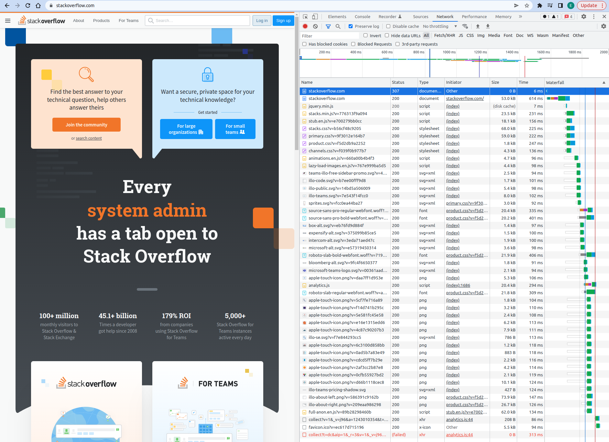

Домашнее задание к занятию ["3.6. Компьютерные сети, лекция 1"](https://github.com/netology-code/sysadm-homeworks/tree/devsys10/03-sysadmin-06-net)

1. Работа c HTTP через телнет.
- Подключитесь утилитой телнет к сайту 
stackoverflow.com telnet stackoverflow.com 80
- отправьте HTTP запрос
```
vagrant@vagrant:~$ telnet stackoverflow.com 80
Trying 151.101.1.69...
Connected to stackoverflow.com.
Escape character is '^]'.
GET /questions HTTP/1.0
HOST: stackoverflow.com

HTTP/1.1 301 Moved Permanently
cache-control: no-cache, no-store, must-revalidate
location: https://stackoverflow.com/questions
x-request-guid: 3751b68f-ea00-4729-a682-32fd9137c565
feature-policy: microphone 'none'; speaker 'none'
content-security-policy: upgrade-insecure-requests; frame-ancestors 'self' https://stackexchange.com
Accept-Ranges: bytes
Date: Mon, 02 May 2022 15:28:28 GMT
Via: 1.1 varnish
Connection: close
X-Served-By: cache-fra19180-FRA
X-Cache: MISS
X-Cache-Hits: 0
X-Timer: S1651505309.692492,VS0,VE92
Vary: Fastly-SSL
X-DNS-Prefetch-Control: off
Set-Cookie: prov=7bc8ddd4-1439-f455-a6c7-db28ae18b1b0; domain=.stackoverflow.com; expires=Fri, 01-Jan-2055 00:00:00 GMT; path=/; HttpOnly

Connection closed by foreign host.
vagrant@vagrant:~$

В ответе мы видим код 301 который означает что нас перенаправили. Адрес перенапрвления https://stackoverflow.com/questions.

Код перенаправления "301 Moved Permanently" протокола передачи гипертекста (HTTP) показывает, что запрошенный ресурс был окончательно перемещён в URL, указанный в заголовке Location (en-US). Браузер в случае такого ответа перенаправляется на эту страницу, а поисковые системы обновляют свои ссылки на ресурс (говоря языком SEO, вес страницы переносится на новый URL-адрес).
```

2. Повторите задание 1 в браузере, используя консоль разработчика F12.
- укажите в ответе полученный HTTP код.
```
Status Code: 307 Internal Redirect
```
- проверьте время загрузки страницы, какой запрос обрабатывался дольше всего?
```
Request URL: https://stackoverflow.com/
Request Method: GET
614ms
```
- приложите скриншот консоли браузера в ответ.


3. Какой IP адрес у вас в интернете?
```
vagrant@vagrant:~$ curl ifconfig.me
xx.xx.xx.xxx
```

4. Какому провайдеру принадлежит ваш IP адрес? Какой автономной системе AS? Воспользуйтесь утилитой whois.       
Посмотрим лучше vk.com
```
vagrant@vagrant:~$ ping vk.com -c 1
PING vk.com (87.240.137.158) 56(84) bytes of data.
64 bytes from srv158-137-240-87.vk.com (87.240.137.158): icmp_seq=1 ttl=63 time=70.9 ms

--- vk.com ping statistics ---
1 packets transmitted, 1 received, 0% packet loss, time 0ms
rtt min/avg/max/mdev = 70.919/70.919/70.919/0.000 ms
vagrant@vagrant:~$ whois 87.240.137.158
% This is the RIPE Database query service.
% The objects are in RPSL format.
%
% The RIPE Database is subject to Terms and Conditions.
% See http://www.ripe.net/db/support/db-terms-conditions.pdf

% Note: this output has been filtered.
%       To receive output for a database update, use the "-B" flag.

% Information related to '87.240.128.0 - 87.240.159.255'

% Abuse contact for '87.240.128.0 - 87.240.159.255' is 'abuse@vk.com'

inetnum:        87.240.128.0 - 87.240.159.255
netname:        VKONTAKTE-FRONT
descr:          VKontakte Services
country:        RU
admin-c:        EY1327-RIPE
admin-c:        VG659-RIPE
tech-c:         MAIL-RU
status:         ASSIGNED PA
mnt-by:         VKONTAKTE
created:        2009-12-24T13:54:52Z
last-modified:  2021-12-24T09:46:46Z
source:         RIPE

role:           VK NOC
address:        Limited liability company Mail.Ru
address:        Leningradskiy prospect, 39/79
address:        125167 Moscow Russia
phone:          +7 495 7256357
fax-no:         +7 495 7256359
remarks:        ------------------------------------------
admin-c:        VG659-RIPE
admin-c:        EY1327-RIPE
tech-c:         DBF3-RIPE
tech-c:         IS13
remarks:        -----------------------------------------
remarks:        General questions: noc@corp.mail.ru
remarks:        Spam & Abuse: abuse@corp.mail.ru
remarks:        Search Abuse: search-abuse@corp.mail.ru
remarks:        Routing inquiries: ncc@corp.mail.ru
remarks:        Peering issues: ncc@corp.mail.ru
remarks:        -----------------------------------------
remarks:        --------- A T T E N T I O N !!! ---------
remarks:        Please use abuse@corp.mail.ru e-mail
remarks:        address for spam and abuse complaints.
remarks:        Mails for other addresses will be ignored!
remarks:        -----------------------------------------
mnt-by:         MNT-NETBRIDGE
abuse-mailbox:  abuse@corp.mail.ru
nic-hdl:        MAIL-RU
created:        2010-11-29T12:03:47Z
last-modified:  2021-12-24T09:11:25Z
source:         RIPE # Filtered

person:         Elena Yakupova
address:        39/79, Leningradsky prospect
address:        Moscow, Russia,125167
phone:          +7 495 725 6357
nic-hdl:        EY1327-RIPE
mnt-by:         MNT-NETBRIDGE
created:        2018-11-14T11:06:34Z
last-modified:  2018-11-14T11:06:34Z
source:         RIPE # Filtered

person:         Vladimir Gabrelyan
address:        47, Leningradsky prospect, Moscow, Russia
fax-no:         +7 495 7256357
phone:          +7 495 7256357
nic-hdl:        VG659-RIPE
mnt-by:         MNT-NETBRIDGE
remarks:        modified for Russian phone area changes
created:        2004-06-08T13:21:36Z
last-modified:  2010-11-29T13:30:08Z
source:         RIPE # Filtered

% Information related to '87.240.128.0/18AS47541'

route:          87.240.128.0/18
descr:          Saint Petersburg region
origin:         AS47541
mnt-by:         VKONTAKTE-NET-MNT
created:        2009-12-24T13:57:25Z
last-modified:  2022-02-15T11:10:40Z
source:         RIPE

% This query was served by the RIPE Database Query Service version 1.102.3 (BLAARKOP)
```
Нас интересуют два поля
```
origin:         AS47541
mnt-by:         VKONTAKTE-NET-MNT
```

5. Через какие сети проходит пакет, отправленный с вашего компьютера на адрес 8.8.8.8? Через какие AS? Воспользуйтесь утилитой traceroute
```
vagrant@vagrant:~$ traceroute -An 8.8.8.8
traceroute to 8.8.8.8 (8.8.8.8), 30 hops max, 60 byte packets
 1  10.0.2.2 [*]  0.118 ms  0.082 ms  0.193 ms
 2  * * *
 3  213.228.116.90 [AS12389]  12.250 ms  12.577 ms  12.544 ms
 4  213.228.112.26 [AS12389]  13.111 ms  13.079 ms  13.044 ms
 5  87.226.183.89 [AS12389]  61.004 ms  60.966 ms  60.931 ms
 6  74.125.52.232 [AS15169]  60.903 ms 74.125.51.172 [AS15169]  57.466 ms 5.143.253.105 [AS12389]  57.409 ms
 7  * 108.170.250.34 [AS15169]  59.711 ms 108.170.250.83 [AS15169]  61.377 ms
 8  142.251.237.154 [AS15169]  86.005 ms 72.14.234.54 [AS15169]  79.542 ms 72.14.234.20 [AS15169]  74.946 ms
 9  216.239.43.20 [AS15169]  72.577 ms 216.239.48.224 [AS15169]  80.316 ms 209.85.254.20 [AS15169]  78.349 ms
10  216.239.58.69 [AS15169]  81.545 ms 216.239.47.173 [AS15169]  83.711 ms 142.250.56.15 [AS15169]  80.247 ms
11  * * *
12  * * *
13  * * *
14  * * *
15  * * *
16  * * *
17  * * *
18  * * *
19  * * 8.8.8.8 [AS15169]  66.533 ms
```

6. Повторите задание 5 в утилите mtr. На каком участке наибольшая задержка - delay?
```
Наибольшая задержка - 10. AS15169  172.253.70.49, смотрим Avg = 75.1

                               My traceroute  [v0.93]
vagrant (10.0.2.15)                                        2022-05-02T16:01:41+0000
Keys:  Help   Display mode   Restart statistics   Order of fields   quit
                                           Packets               Pings
 Host                                    Loss%   Snt   Last   Avg  Best  Wrst StDev
 1. AS???    10.0.2.2                     0.0%     8    0.2   0.3   0.2   0.5   0.1
 2. (waiting for reply)
 3. AS12389  213.228.116.90               0.0%     8   22.7  14.4   5.2  31.7   8.7
 4. AS12389  213.228.112.8                0.0%     8   23.3  24.7  10.7  36.5   9.8
 5. AS12389  87.226.181.89                0.0%     8   49.4  53.8  49.4  59.5   3.6
 6. AS15169  74.125.51.172                0.0%     7   51.7  54.6  49.5  60.5   3.5
 7. AS15169  108.170.250.66               0.0%     7   60.1  56.5  49.7  60.1   4.2
 8. AS15169  209.85.255.136               0.0%     7   72.6  70.6  64.4  74.4   3.6
 9. AS15169  172.253.65.82                0.0%     7   71.2  69.1  62.8  73.0   3.4
10. AS15169  172.253.70.49                0.0%     7   74.7  75.1  71.1  79.7   2.7
11. (waiting for reply)
12. (waiting for reply)
13. (waiting for reply)
14. (waiting for reply)
15. (waiting for reply)
16. (waiting for reply)
17. (waiting for reply)
18. (waiting for reply)
19. (waiting for reply)
20. AS15169  8.8.8.8                      0.0%     7   71.4  70.7  68.1  74.4   2.4
```

7. Какие DNS сервера отвечают за доменное имя dns.google? Какие A записи? воспользуйтесь утилитой dig           
- f.root-servers.net            
google.                 172800  IN      NS      ns-tld1.charlestonroadregistry.com.             
google.                 172800  IN      NS      ns-tld2.charlestonroadregistry.com.             
google.                 172800  IN      NS      ns-tld3.charlestonroadregistry.com.             
google.                 172800  IN      NS      ns-tld4.charlestonroadregistry.com.             
google.                 172800  IN      NS      ns-tld5.charlestonroadregistry.com.             
- ns-tld2.charlestonroadregistry.com            
dns.google.             10800   IN      NS      ns4.zdns.google.                
dns.google.             10800   IN      NS      ns2.zdns.google.                
dns.google.             10800   IN      NS      ns3.zdns.google.                
dns.google.             10800   IN      NS      ns1.zdns.google.                
- ns2.zdns.google               
dns.google.             900     IN      A       8.8.8.8         
dns.google.             900     IN      A       8.8.4.4         
```
vagrant@vagrant:~$ dig +trace @8.8.8.8 dns.google

; <<>> DiG 9.16.1-Ubuntu <<>> +trace @8.8.8.8 dns.google
; (1 server found)
;; global options: +cmd
.                       32807   IN      NS      f.root-servers.net.
.                       32807   IN      NS      a.root-servers.net.
.                       32807   IN      NS      k.root-servers.net.
.                       32807   IN      NS      h.root-servers.net.
.                       32807   IN      NS      l.root-servers.net.
.                       32807   IN      NS      b.root-servers.net.
.                       32807   IN      NS      g.root-servers.net.
.                       32807   IN      NS      e.root-servers.net.
.                       32807   IN      NS      m.root-servers.net.
.                       32807   IN      NS      j.root-servers.net.
.                       32807   IN      NS      d.root-servers.net.
.                       32807   IN      NS      c.root-servers.net.
.                       32807   IN      NS      i.root-servers.net.
.                       32807   IN      RRSIG   NS 8 0 518400 20220514170000 20220501160000 47671 . dMrXEguX3aiZGmCLU5ecvaB1oEFM2Wdqy0GfmlyLefCrB2bPyKoKKGkG 1bk9UCyqu5IuePDbD6PFDPdel118AO4YGSwFSNndQf8p8WKKNHnn4Xqo nocowFOdQkTO2oAPmdishi5HcsvOwgasD1r/Q4OQ8UGNSAXDG2gUo1yE D4dFjrVjd5Jzb4Wcj88idFixr1Nhi2Pj7DSCk6HvEsfHAY/ZvVlZewpU 655yVsT6GCewQHkR1XIRAsXx6wCeEd406cS4pdcQpPbux12okeLCCcxG Orfig54JXrdx16Ubf/tr8mBe3tgDoPKHD9k6MCm4B2/ofXBsHpYAALb2 d5T7JA==
;; Received 525 bytes from 8.8.8.8#53(8.8.8.8) in 76 ms

google.                 172800  IN      NS      ns-tld1.charlestonroadregistry.com.
google.                 172800  IN      NS      ns-tld2.charlestonroadregistry.com.
google.                 172800  IN      NS      ns-tld3.charlestonroadregistry.com.
google.                 172800  IN      NS      ns-tld4.charlestonroadregistry.com.
google.                 172800  IN      NS      ns-tld5.charlestonroadregistry.com.
google.                 86400   IN      DS      6125 8 2 80F8B78D23107153578BAD3800E9543500474E5C30C29698B40A3DB2 3ED9DA9F
google.                 86400   IN      RRSIG   DS 8 1 86400 20220515050000 20220502040000 47671 . H3FEjinwjRq7/Ah9syVSTlTltI0GcMUDyyHCNDXoS4V5FAeO0DPdQO3y PHwxX4cAoXDMtNXtupqMebgveLijdK7DlI+DqFba/bt4eBHo8emvfuID a79T2IpFp/1MSZ9MzEpb7NvHHa3MHFocBIjzTi7ZISgMPOoFqZkeXDd9 N3929iMETYLKfpqXRiq4WEAepYEObI0WWXbHF1PJ3g4RKWSGIIC7l33j 7PPd6SHaiEkrTsK1VT+oEk+mgmK/yLDqDGYkNYZWrtWlXwcz5dxCQq8t o35iNXj7jpuctQ+oNLKKuab/UFfFDo44eU08qqzu83InCKMLB+LQTlUF xXKQQw==
;; Received 730 bytes from 192.5.5.241#53(f.root-servers.net) in 56 ms

dns.google.             10800   IN      NS      ns4.zdns.google.
dns.google.             10800   IN      NS      ns2.zdns.google.
dns.google.             10800   IN      NS      ns3.zdns.google.
dns.google.             10800   IN      NS      ns1.zdns.google.
dns.google.             3600    IN      DS      56044 8 2 1B0A7E90AA6B1AC65AA5B573EFC44ABF6CB2559444251B997103D2E4 0C351B08
dns.google.             3600    IN      RRSIG   DS 8 2 3600 20220522154433 20220430154433 3730 google. WIHKJaW/yR7kacMSETgF7rJ1fmNYm7HZQqae83BMCav/Cca+lChK+btl GH+AQefKWonHoy8f3FsEtjeyi0EikoPlPbfFIacY56OtB+huLrBUO0Pl e99DV7/3WbpDwZcswrAIxO4BCHM1fLfiCF+fFjAne19JLT6R9NOA4YtW GYQ=
;; Received 506 bytes from 216.239.34.105#53(ns-tld2.charlestonroadregistry.com) in 96 ms

dns.google.             900     IN      A       8.8.8.8
dns.google.             900     IN      A       8.8.4.4
dns.google.             900     IN      RRSIG   A 8 2 900 20220521214310 20220429214310 50974 dns.google. ICb4HG6un7BSzFnpAzhT2n5DzETO4cQCiCUTzTHhZoRkPKQ69Fb8zlTr 3NOJC8V69yewkkeRrr9LM1g/KiEziOQVY9iANoeaxk9vRTkO6ElngixI rr9A/q9Tz9nOIk0bZD2xgu2/WbfikX83wxmqaKIVMKphC496mT8IMVxg tAA=
;; Received 241 bytes from 216.239.34.114#53(ns2.zdns.google) in 100 ms
```

8. Проверьте PTR записи для IP адресов из задания 7. Какое доменное имя привязано к IP? воспользуйтесь утилитой dig.
- PTR dns.google
```
vagrant@vagrant:~$ dig -x 8.8.8.8

; <<>> DiG 9.16.1-Ubuntu <<>> -x 8.8.8.8
;; global options: +cmd
;; Got answer:
;; ->>HEADER<<- opcode: QUERY, status: NOERROR, id: 606
;; flags: qr rd ra; QUERY: 1, ANSWER: 1, AUTHORITY: 0, ADDITIONAL: 1

;; OPT PSEUDOSECTION:
; EDNS: version: 0, flags:; udp: 65494
;; QUESTION SECTION:
;8.8.8.8.in-addr.arpa.          IN      PTR

;; ANSWER SECTION:
8.8.8.8.in-addr.arpa.   3593    IN      PTR     dns.google.

;; Query time: 0 msec
;; SERVER: 127.0.0.53#53(127.0.0.53)
;; WHEN: Mon May 02 16:12:19 UTC 2022
;; MSG SIZE  rcvd: 73

vagrant@vagrant:~$ dig -x 8.8.4.4

; <<>> DiG 9.16.1-Ubuntu <<>> -x 8.8.4.4
;; global options: +cmd
;; Got answer:
;; ->>HEADER<<- opcode: QUERY, status: NOERROR, id: 64408
;; flags: qr rd ra; QUERY: 1, ANSWER: 1, AUTHORITY: 0, ADDITIONAL: 1

;; OPT PSEUDOSECTION:
; EDNS: version: 0, flags:; udp: 65494
;; QUESTION SECTION:
;4.4.8.8.in-addr.arpa.          IN      PTR

;; ANSWER SECTION:
4.4.8.8.in-addr.arpa.   52796   IN      PTR     dns.google.

;; Query time: 12 msec
;; SERVER: 127.0.0.53#53(127.0.0.53)
;; WHEN: Mon May 02 16:12:25 UTC 2022
;; MSG SIZE  rcvd: 73
```