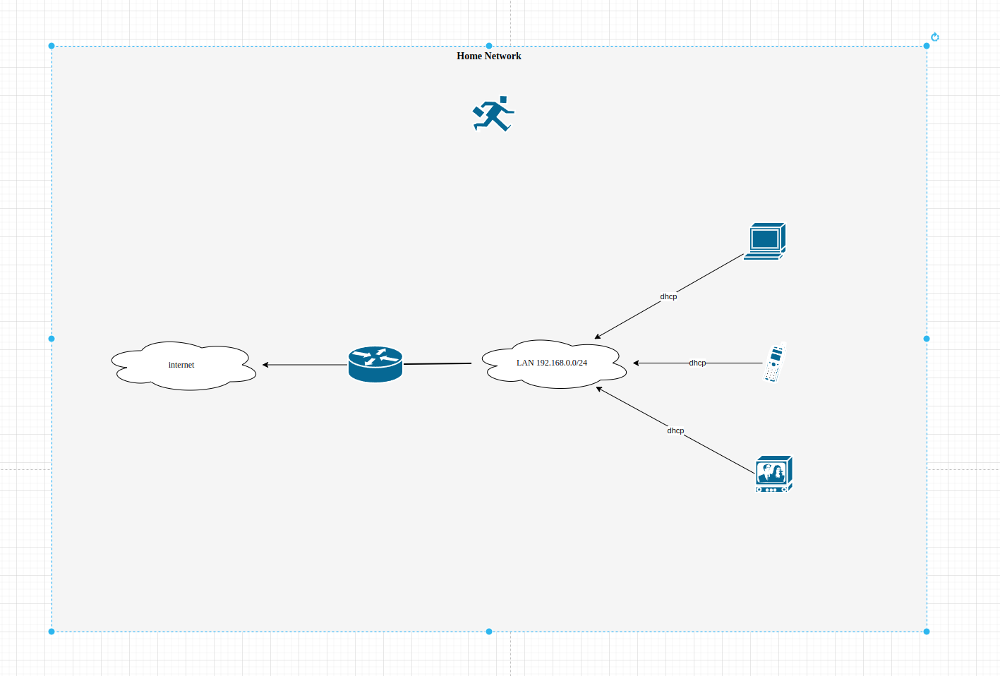

# Домашнее задание к занятию  ["3.8. Компьютерные сети, лекция 3"](https://github.com/netology-code/sysadm-homeworks/blob/devsys10/03-sysadmin-08-net/README.md)

### 1. Подключитесь к публичному маршрутизатору в интернет. Найдите маршрут к вашему публичному IP
```
telnet route-views.routeviews.org
Username: rviews
show ip route x.x.x.x/32
show bgp x.x.x.x/32
```

Ответ:  
```
vagrant@vagrant:~$ ping vk.com
PING vk.com (87.240.139.194) 56(84) bytes of data.
64 bytes from srv194-139-240-87.vk.com (87.240.139.194): icmp_seq=1 ttl=63 time=69.2 ms
^C
--- vk.com ping statistics ---
1 packets transmitted, 1 received, 0% packet loss, time 0ms
rtt min/avg/max/mdev = 69.156/69.156/69.156/0.000 ms
vagrant@vagrant:~$ telnet route-views.routeviews.org
Trying 128.223.51.103...
Connected to route-views.routeviews.org.
Escape character is '^]'.
C
**********************************************************************

                    RouteViews BGP Route Viewer
                    route-views.routeviews.org

 route views data is archived on http://archive.routeviews.org

 This hardware is part of a grant by the NSF.
 Please contact help@routeviews.org if you have questions, or
 if you wish to contribute your view.

 This router has views of full routing tables from several ASes.
 The list of peers is located at http://www.routeviews.org/peers
 in route-views.oregon-ix.net.txt

 NOTE: The hardware was upgraded in August 2014.  If you are seeing
 the error message, "no default Kerberos realm", you may want to
 in Mac OS X add "default unset autologin" to your ~/.telnetrc

 To login, use the username "rviews".

 **********************************************************************


User Access Verification

Username: rviews
route-views>show ip route 87.240.139.194/32
                                        ^
% Invalid input detected at '^' marker.

route-views>show ip route 87.240.139.194   
Routing entry for 87.240.128.0/18
  Known via "bgp 6447", distance 20, metric 0
  Tag 6939, type external
  Last update from 64.71.137.241 1w5d ago
  Routing Descriptor Blocks:
  * 64.71.137.241, from 64.71.137.241, 1w5d ago
      Route metric is 0, traffic share count is 1
      AS Hops 2
      Route tag 6939
      MPLS label: none
route-views>show bgp  87.240.139.194    
BGP routing table entry for 87.240.128.0/18, version 2248309796
Paths: (24 available, best #24, table default)
  Not advertised to any peer
  Refresh Epoch 1
  7018 1299 47541
    12.0.1.63 from 12.0.1.63 (12.0.1.63)
      Origin IGP, localpref 100, valid, external
      Community: 7018:5000 7018:37232
      path 7FE0C6B22318 RPKI State not found
      rx pathid: 0, tx pathid: 0
  Refresh Epoch 1
  4901 6079 31133 47541
    162.250.137.254 from 162.250.137.254 (162.250.137.254)
      Origin IGP, localpref 100, valid, external
      Community: 65000:10100 65000:10300 65000:10400
      path 7FE1676458E8 RPKI State not found
      rx pathid: 0, tx pathid: 0
  Refresh Epoch 1
  53767 174 31133 47541
    162.251.163.2 from 162.251.163.2 (162.251.162.3)
      Origin IGP, localpref 100, valid, external
      Community: 174:21101 174:22005 53767:5000
      path 7FE0F6A484F8 RPKI State not found
      rx pathid: 0, tx pathid: 0
...
```

### 2. Создайте dummy0 интерфейс в Ubuntu. Добавьте несколько статических маршрутов. Проверьте таблицу маршрутизации.

Ответ:
```
#Создаём dummy интерфейс
vagrant@vagrant:~$ echo "dummy" | sudo tee -a /etc/modules
vagrant@vagrant:~$ sudo touch /etc/modprobe.d/dummy.conf
vagrant@vagrant:~$ echo "options dummy numdummies=2" | sudo tee /etc/modprobe.d/dummy.conf
vagrant@vagrant:~$ options dummy numdummies=1
vagrant@vagrant:~$ sudo ip link add dummy0 type dummy
vagrant@vagrant:~$ ip l
1: lo: <LOOPBACK,UP,LOWER_UP> mtu 65536 qdisc noqueue state UNKNOWN mode DEFAULT group default qlen 1000
    link/loopback 00:00:00:00:00:00 brd 00:00:00:00:00:00
2: eth0: <BROADCAST,MULTICAST,UP,LOWER_UP> mtu 1500 qdisc fq_codel state UP mode DEFAULT group default qlen 1000
    link/ether 08:00:27:b1:28:5d brd ff:ff:ff:ff:ff:ff
3: dummy0: <BROADCAST,NOARP> mtu 1500 qdisc noop state DOWN mode DEFAULT group default qlen 1000
    link/ether ea:01:83:7c:16:9d brd ff:ff:ff:ff:ff:ff

#Добавляем пару маршрутов
vagrant@vagrant:~$ sudo ip route add 172.16.10.0/24 via 10.0.2.15
vagrant@vagrant:~$ sudo ip route add 172.16.10.0/24 via 10.0.2.15
vagrant@vagrant:~$ ip -br route
default via 10.0.2.2 dev eth0 proto dhcp src 10.0.2.15 metric 100 
10.0.2.0/24 dev eth0 proto kernel scope link src 10.0.2.15 
10.0.2.2 dev eth0 proto dhcp scope link src 10.0.2.15 metric 100 
172.16.0.0/24 dev eth0 scope link 
172.16.10.0/24 via 10.0.2.15 dev eth0 
```

### 3. Проверьте открытые TCP порты в Ubuntu, какие протоколы и приложения используют эти порты? Приведите несколько примеров.

Ответ:
```
vagrant@vagrant:~$ ss -t
State            Recv-Q            Send-Q                       Local Address:Port                        Peer Address:Port             Process            
ESTAB            0                 0                                10.0.2.15:ssh                             10.0.2.2:46446
#10.0.2.15:ssh подключение по ssh использует 22 порт больше соединений нет
#Примеры: http - 80 порт, https - 443 порт
```

### 4. Проверьте используемые UDP сокеты в Ubuntu, какие протоколы и приложения используют эти порты?

Ответ:
```
vagrant@vagrant:~$ ss -uan
State             Recv-Q            Send-Q                        Local Address:Port                       Peer Address:Port            Process            
UNCONN            0                 0                             127.0.0.53%lo:53                              0.0.0.0:*                                  
UNCONN            0                 0                            10.0.2.15%eth0:68                              0.0.0.0:*                                  
vagrant@vagrant:~$
# 53 - DOMAIN (Domain Name System, DNS), 68 - DHCP (Dynamic Host Configuration Protocol)
```

### 5. Используя diagrams.net, создайте L3 диаграмму вашей домашней сети или любой другой сети, с которой вы работали.

Ответ:
