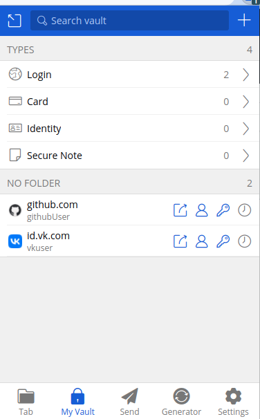
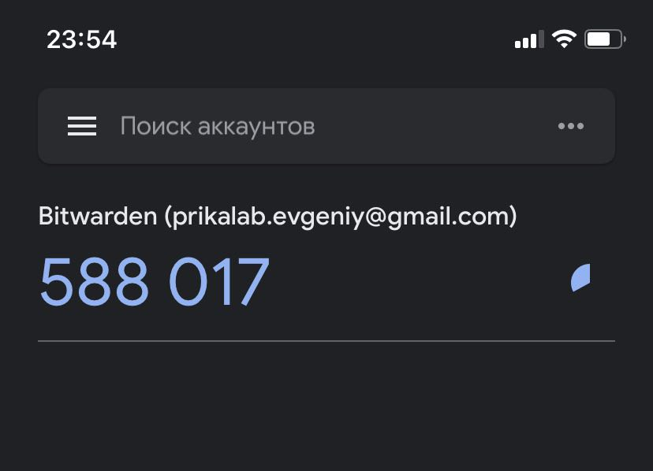
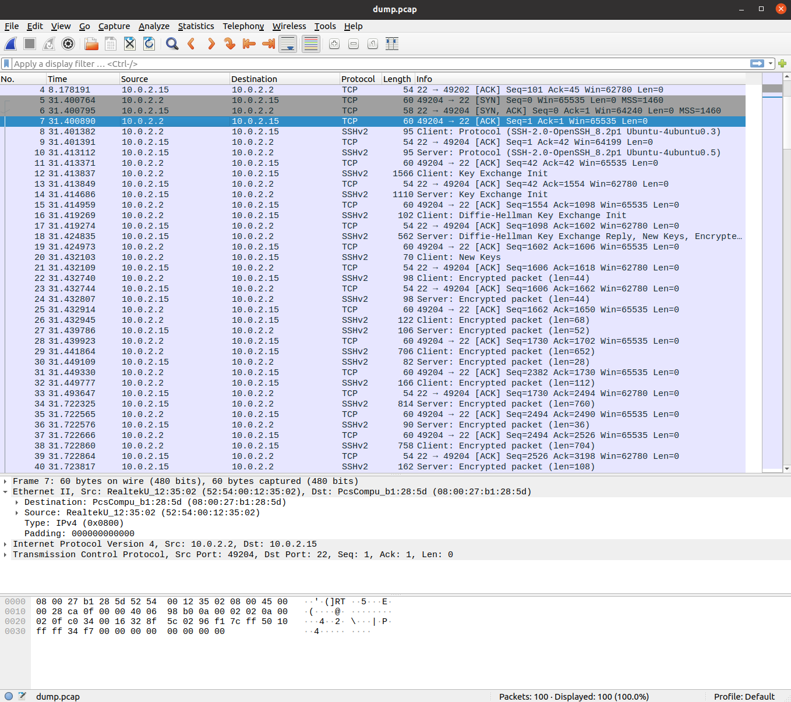

# Домашнее задание к занятию ["3.9. Элементы безопасности информационных систем"](https://github.com/netology-code/sysadm-homeworks/tree/devsys10/03-sysadmin-09-security)

### 1. Установите Bitwarden плагин для браузера. Зарегестрируйтесь и сохраните несколько паролей.
Ответ:  


### 2. Установите Google authenticator на мобильный телефон. Настройте вход в Bitwarden акаунт через Google authenticator OTP.
Ответ:  


### 3. Установите apache2, сгенерируйте самоподписанный сертификат, настройте тестовый сайт для работы по HTTPS.
Ответ:
```
#Устанавливаем apcahe2
sudo apt install apache2

#Включаем ssl модуль
sudo a2enmod ssl

#Рестарт apache2
sudo systemctl restart apache2

#Создаём серт
sudo openssl req -x509 -nodes -days 365 -newkey rsa:2048 \
-keyout /etc/ssl/private/apache-selfsigned.key \
-out /etc/ssl/certs/apache-selfsigned.crt \
-subj "/C=RU/ST=Moscow/L=Moscow/O=Company Name/OU=Org/CN=www.example.com"

#Создаём конфиг для apache2  
vagrant@vagrant:~$ cat /etc/apache2/sites-available/testDomain.conf 
<VirtualHost *:443>
        ServerName testDomain
        DocumentRoot /var/www/testDomain
        SSLEngine on
        SSLCertificateFile /etc/ssl/certs/apache-selfsigned.crt
        SSLCertificateKeyFile /etc/ssl/private/apache-selfsigned.key
</VirtualHost>

#Создаём index.html для нашего тестового сайта  
vagrant@vagrant:~$ cat /var/www/testDomain/index.html 
<h1>it worked!</h1>

#Включаем в apache тестовый сайт
sudo a2ensite testDomain.conf

#Проверяем конфиг
vagrant@vagrant:~$ sudo apache2ctl configtest
AH00558: apache2: Could not reliably determine the server's fully qualified domain name, using 127.0.1.1. Set the 'ServerName' directive globally to suppress this message
Syntax OK

#Рестарт apache2
sudo systemctl restart apache2

#Проверяем
vagrant@vagrant:~$ curl https://testDomain.localhost --resolve 'testDomain.localhost:127.0.0.1'
curl: (60) SSL certificate problem: self signed certificate
More details here: https://curl.haxx.se/docs/sslcerts.html

curl failed to verify the legitimacy of the server and therefore could not
establish a secure connection to it. To learn more about this situation and
how to fix it, please visit the web page mentioned above.
vagrant@vagrant:~$ curl -k https://testDomain.localhost --resolve 'testDomain.localhost:127.0.0.1'
<h1>it worked!</h1>
```

### 4. Проверьте на TLS уязвимости произвольный сайт в интернете (кроме сайтов МВД, ФСБ, МинОбр, НацБанк, РосКосмос, РосАтом, РосНАНО и любых госкомпаний, объектов КИИ, ВПК ... и тому подобное).
Ответ:
```
vagrant@vagrant:~$ git clone --depth 1 https://github.com/drwetter/testssl.sh.git
Cloning into 'testssl.sh'...
remote: Enumerating objects: 102, done.
remote: Counting objects: 100% (102/102), done.
remote: Compressing objects: 100% (93/93), done.
remote: Total 102 (delta 15), reused 28 (delta 8), pack-reused 0
Receiving objects: 100% (102/102), 8.54 MiB | 4.65 MiB/s, done.
Resolving deltas: 100% (15/15), done.
vagrant@vagrant:~$ cd testssl.sh/

vagrant@vagrant:~/testssl.sh$ ./testssl.sh -U --sneaky https://www.google.com/

###########################################################
    testssl.sh       3.1dev from https://testssl.sh/dev/
    (d931eb4 2022-05-14 13:57:46)

      This program is free software. Distribution and
             modification under GPLv2 permitted.
      USAGE w/o ANY WARRANTY. USE IT AT YOUR OWN RISK!

       Please file bugs @ https://testssl.sh/bugs/

###########################################################

 Using "OpenSSL 1.0.2-chacha (1.0.2k-dev)" [~183 ciphers]
 on vagrant:./bin/openssl.Linux.x86_64
 (built: "Jan 18 17:12:17 2019", platform: "linux-x86_64")


Testing all IPv4 addresses (port 443): 74.125.131.147 74.125.131.99 74.125.131.105 74.125.131.103 74.125.131.106 74.125.131.104
--------------------------------------------------------
 Start 2022-05-22 18:17:48        -->> 74.125.131.147:443 (www.google.com) <<--

 Further IP addresses:   74.125.131.99 74.125.131.105 74.125.131.103 74.125.131.106
                         74.125.131.104 2a00:1450:4010:c0e::67
                         2a00:1450:4010:c0e::93 2a00:1450:4010:c0e::68
                         2a00:1450:4010:c0e::69 
 rDNS (74.125.131.147):  lu-in-f147.1e100.net.
 Service detected:       HTTP


 Testing vulnerabilities 

 Heartbleed (CVE-2014-0160)                not vulnerable (OK), no heartbeat extension
 CCS (CVE-2014-0224)                       not vulnerable (OK)
 Ticketbleed (CVE-2016-9244), experiment.  not vulnerable (OK)
 ROBOT                                     not vulnerable (OK)
 Secure Renegotiation (RFC 5746)           supported (OK)
 Secure Client-Initiated Renegotiation     not vulnerable (OK)
 CRIME, TLS (CVE-2012-4929)                not vulnerable (OK)
 BREACH (CVE-2013-3587)                    potentially NOT ok, "br gzip" HTTP compression detected. - only supplied "/" tested
                                           Can be ignored for static pages or if no secrets in the page
 POODLE, SSL (CVE-2014-3566)               not vulnerable (OK)
 TLS_FALLBACK_SCSV (RFC 7507)              Downgrade attack prevention supported (OK)
 SWEET32 (CVE-2016-2183, CVE-2016-6329)    VULNERABLE, uses 64 bit block ciphers
 FREAK (CVE-2015-0204)                     not vulnerable (OK)
 DROWN (CVE-2016-0800, CVE-2016-0703)      not vulnerable on this host and port (OK)
                                           make sure you don't use this certificate elsewhere with SSLv2 enabled services, see
                                           https://search.censys.io/search?resource=hosts&virtual_hosts=INCLUDE&q=F9B75DED32B37E0C014857A994675697ACDD274DCC2917E26C904D776ED54CB6
 LOGJAM (CVE-2015-4000), experimental      not vulnerable (OK): no DH EXPORT ciphers, no DH key detected with <= TLS 1.2
 BEAST (CVE-2011-3389)                     TLS1: ECDHE-ECDSA-AES128-SHA
                                                 ECDHE-ECDSA-AES256-SHA
                                                 ECDHE-RSA-AES128-SHA
                                                 ECDHE-RSA-AES256-SHA AES128-SHA
                                                 AES256-SHA DES-CBC3-SHA 
                                           VULNERABLE -- but also supports higher protocols  TLSv1.1 TLSv1.2 (likely mitigated)
 LUCKY13 (CVE-2013-0169), experimental     potentially VULNERABLE, uses cipher block chaining (CBC) ciphers with TLS. Check patches
 Winshock (CVE-2014-6321), experimental    not vulnerable (OK)
 RC4 (CVE-2013-2566, CVE-2015-2808)        no RC4 ciphers detected (OK)


 Done 2022-05-22 18:18:27 [  40s] -->> 74.125.131.147:443 (www.google.com) <<--

--------------------------------------------------------
```

### 5. Установите на Ubuntu ssh сервер, сгенерируйте новый приватный ключ. Скопируйте свой публичный ключ на другой сервер. Подключитесь к серверу по SSH-ключу.
Ответ:  
```
# установка sshd сервера
vagrant@vagrant:~$ sudo apt install openssh-server  
vagrant@vagrant:~$ sudo systemctl start sshd.service  
vagrant@vagrant:~$ sudo systemctl status sshd.service
● ssh.service - OpenBSD Secure Shell server
     Loaded: loaded (/lib/systemd/system/ssh.service; enabled; vendor preset: enabl>
     Active: active (running) since Sun 2022-05-22 18:31:25 UTC; 27s ago
       Docs: man:sshd(8)
             man:sshd_config(5)
    Process: 36517 ExecStartPre=/usr/sbin/sshd -t (code=exited, status=0/SUCCESS)
   Main PID: 36528 (sshd)
      Tasks: 1 (limit: 1071)
     Memory: 1.1M
     CGroup: /system.slice/ssh.service
             └─36528 sshd: /usr/sbin/sshd -D [listener] 0 of 10-100 startups

May 22 18:31:25 vagrant systemd[1]: Starting OpenBSD Secure Shell server...
May 22 18:31:25 vagrant sshd[36528]: Server listening on 0.0.0.0 port 22.
May 22 18:31:25 vagrant sshd[36528]: Server listening on :: port 22.
May 22 18:31:25 vagrant systemd[1]: Started OpenBSD Secure Shell server.

# Генерим ключи  
vagrant@vagrant:~/.ssh$ ssh-keygen 
Generating public/private rsa key pair.
Enter file in which to save the key (/home/vagrant/.ssh/id_rsa): 
Enter passphrase (empty for no passphrase): 
Enter same passphrase again: 
Your identification has been saved in /home/vagrant/.ssh/id_rsa
Your public key has been saved in /home/vagrant/.ssh/id_rsa.pub
The key fingerprint is:
SHA256:cpXA9uO3kxBpe3QrBNYAPG8S+nIntNOiAtJsIzBk3Mc vagrant@vagrant
The key's randomart image is:
+---[RSA 3072]----+
|. . .  oo..o     |
| + . E  *.o..    |
|o   .  o *oo     |
|o     . o.O o .  |
|.+    .oSB * . . |
|o *   .oB * + .  |
| + o   + = + +   |
|    . .     +    |
|     .       .   |
+----[SHA256]-----+
vagrant@vagrant:~/.ssh$ ls -la
total 20
drwx------ 2 vagrant root    4096 May 22 18:34 .
drwxr-xr-x 5 vagrant vagrant 4096 May 22 18:16 ..
-rw------- 1 vagrant vagrant  389 May 22 17:30 authorized_keys
-rw------- 1 vagrant vagrant 2602 May 22 18:34 id_rsa
-rw-r--r-- 1 vagrant vagrant  569 May 22 18:34 id_rsa.pub

#Создадим пользователя test_user
vagrant@vagrant:~/.ssh$ sudo useradd -m test_user

#Добавим ему публичный ключ
vagrant@vagrant:~/.ssh$ cat id_rsa.pub | sudo tee /home/test_user/.ssh/authorized_keys

#Проверяем
vagrant@vagrant:~/.ssh$ sudo ssh -l test_user 127.0.0.1test_user@127.0.0.1's password: 
Welcome to Ubuntu 20.04.3 LTS (GNU/Linux 5.4.0-91-generic x86_64)
...
$ 
```

### 6. Переименуйте файлы ключей из задания 5. Настройте файл конфигурации SSH клиента, так чтобы вход на удаленный сервер осуществлялся по имени сервера.
Ответ:  
```
#Переименуем ключи
vagrant@vagrant:~/.ssh$ mv id_rsa rename_id_rsa
vagrant@vagrant:~/.ssh$ mv id_rsa.pub rename_id_rsa.pub
vagrant@vagrant:~/.ssh$ ls -la
total 24
drwx------ 2 vagrant root    4096 May 22 18:49 .
drwxr-xr-x 5 vagrant vagrant 4096 May 22 18:16 ..
-rw------- 1 vagrant vagrant  389 May 22 17:30 authorized_keys
-rw-r--r-- 1 vagrant vagrant  222 May 22 18:38 known_hosts
-rw------- 1 vagrant vagrant 2602 May 22 18:34 rename_id_rsa
-rw-r--r-- 1 vagrant vagrant  569 May 22 18:34 rename_id_rsa.pub

#Создаём конфиг
vagrant@vagrant:~/.ssh$ cat config 
host localhost
  hostname 127.0.0.1
  user test_user
  identityfile ~/.ssh/rename_id_rsa

#Проверяем
vagrant@vagrant:~/.ssh$ ssh localhost
test_user@127.0.0.1's password: 
Welcome to Ubuntu 20.04.3 LTS (GNU/Linux 5.4.0-91-generic x86_64)
...
Last login: Sun May 22 18:46:24 2022 from 127.0.0.1
$ 
```

### 7. Соберите дамп трафика утилитой tcpdump в формате pcap, 100 пакетов. Откройте файл pcap в Wireshark.
Ответ:
```
#Собираем dump
vagrant@vagrant:~$ sudo tcpdump -c 100 -w dump.pcap
tcpdump: listening on eth0, link-type EN10MB (Ethernet), capture size 262144 bytes
100 packets captured
106 packets received by filter
0 packets dropped by kernel

#Копируем
evgeniy@r2-d2:~/projects/devops-netology/vagrant$ scp -P 2222 vagrant@127.0.0.1:/home/vagrant/dump.pcap ./dump.pcap
vagrant@127.0.0.1's password: 
dump.p 100%   15KB  12.8MB/s   00:00    

#Устанавливаем wireshark
evgeniy@r2-d2:~/projects/devops-netology/vagrant$ sudo apt install wireshark

#Смотрим dump
```


